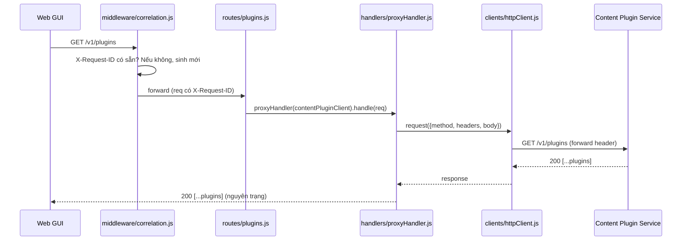
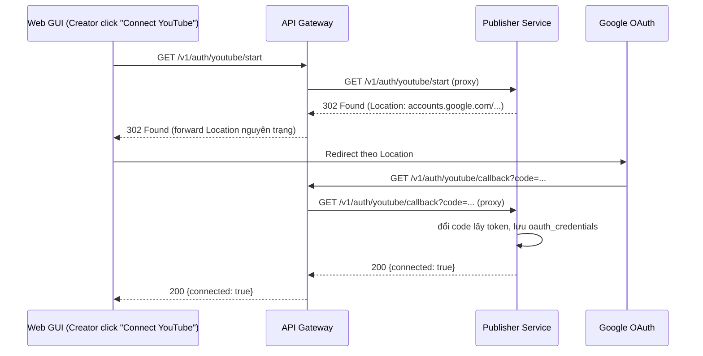
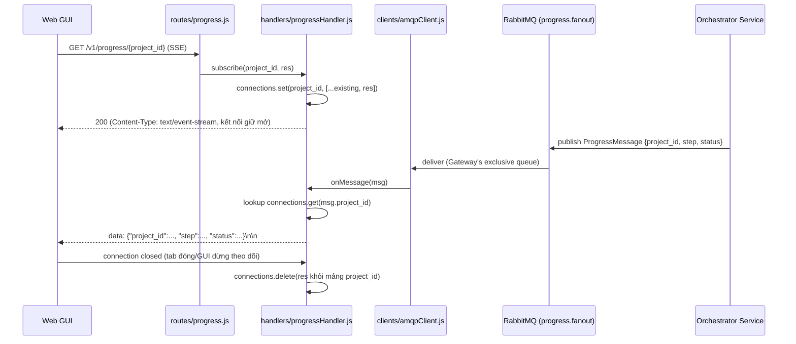
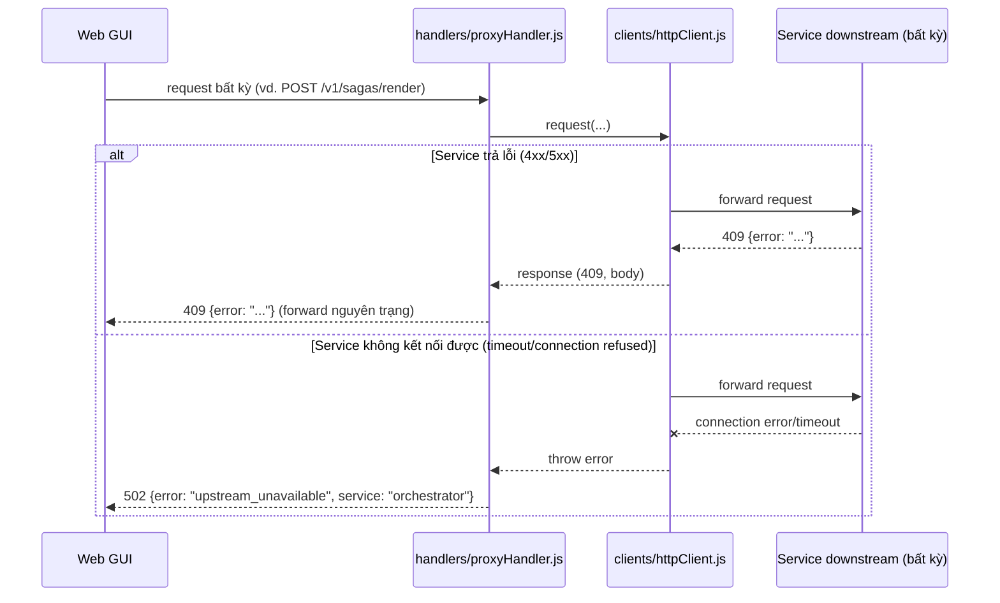

# Sequence Flows — Unit 9: API Gateway

## Flow 1: Generic REST Proxy (vd. GET /v1/plugins)

## Flow 2: OAuth Redirect (GET /v1/auth/youtube/start)

## Flow 3: SSE Subscribe + AMQP Fan-out

## Flow 4: Downstream Error/Timeout

