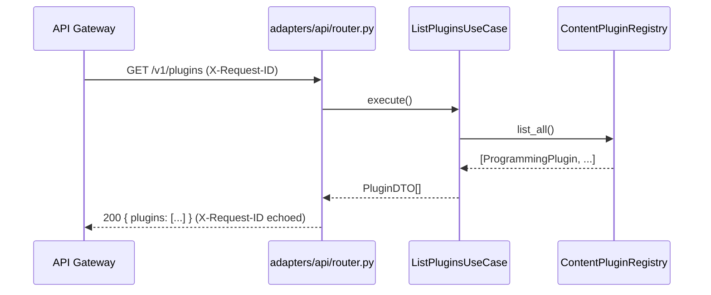
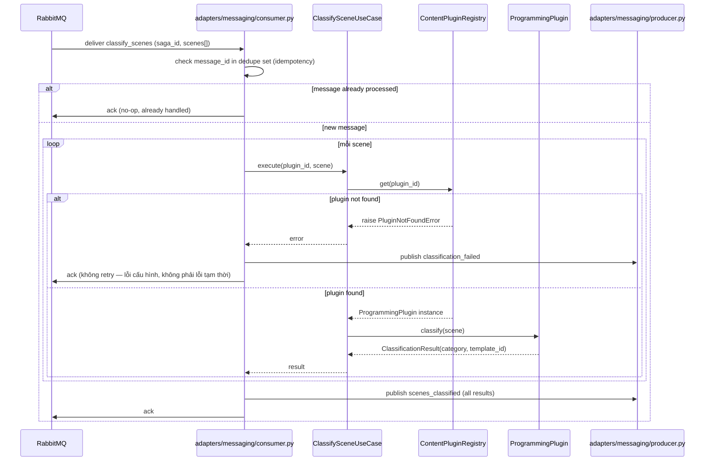
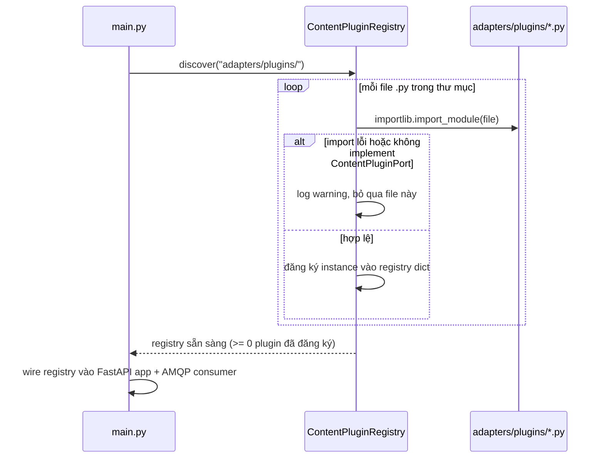

# Sequence Flows — Unit 2: Content Plugin Service

## Flow 1: List Plugins (REST, ngoài Saga)

## Flow 2: Classify Scenes (AMQP, trong Saga)

## Flow 3: Service Startup — Dynamic Plugin Discovery

