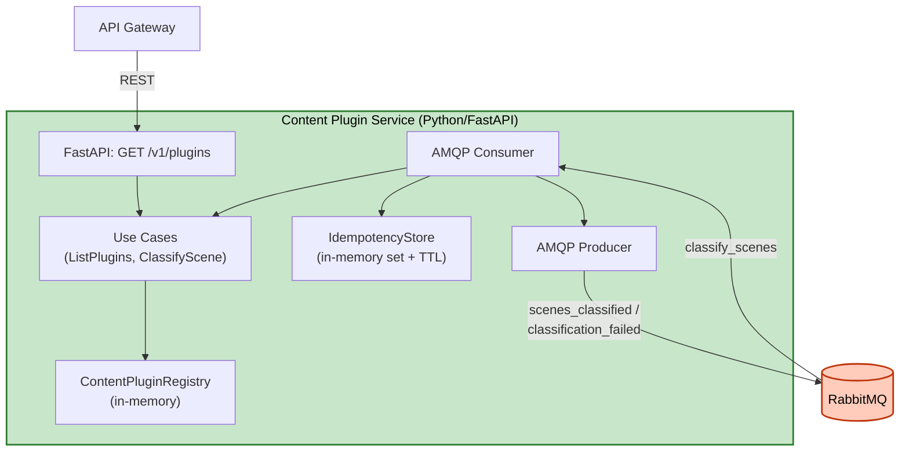

# Logical Components — Unit 2: Content Plugin Service

## Components
| Component | Type | Purpose |
|---|---|---|
| `ContentPluginRegistry` | In-memory registry | Lưu trữ plugin đã discover, tra cứu theo `plugin_id` |
| `IdempotencyStore` | In-memory `set[message_id]` + TTL cleanup task | Dedupe message AMQP đã xử lý |
| FastAPI app | HTTP server | Expose `GET /v1/plugins` |
| AMQP Consumer (`aio-pika`) | Message consumer | Nhận `classify_scenes`, auto-reconnect built-in |
| AMQP Producer (`aio-pika`) | Message producer | Publish `scenes_classified`/`classification_failed` |

## No External Infrastructure Components
Không cần cache ngoài (Redis), không cần database, không cần circuit breaker riêng — mọi state là in-memory, mọi resilience dựa vào cơ chế có sẵn của `aio-pika` + RabbitMQ (Unit 1).

## Diagram

