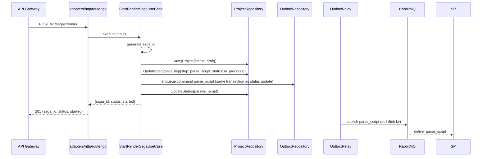
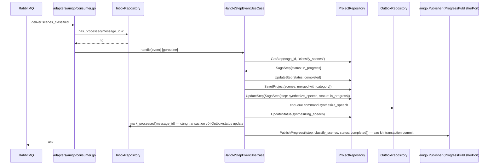
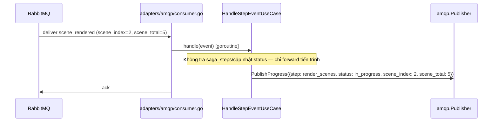
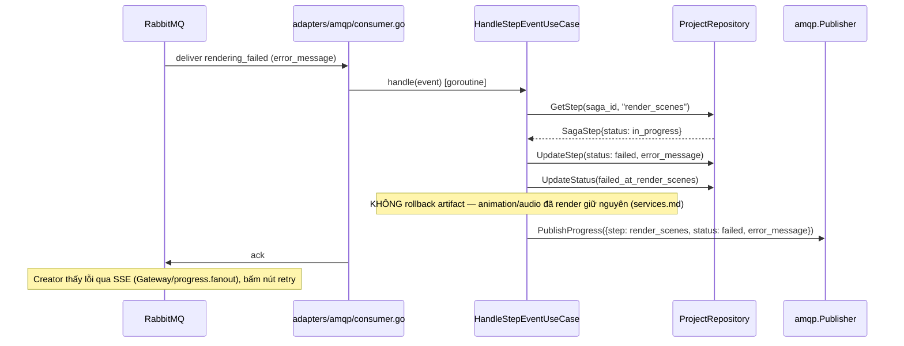
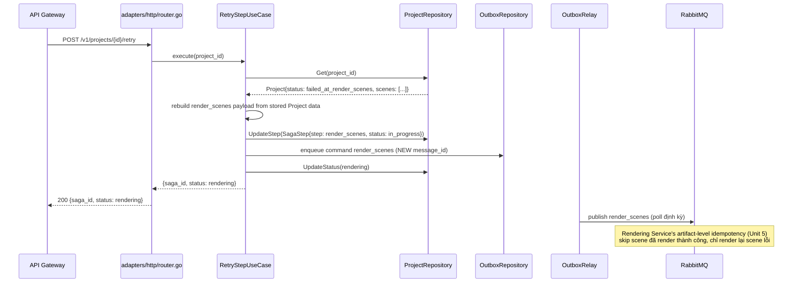
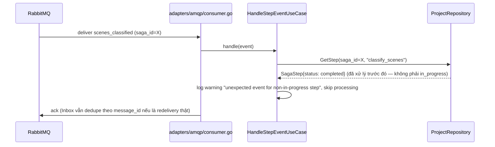
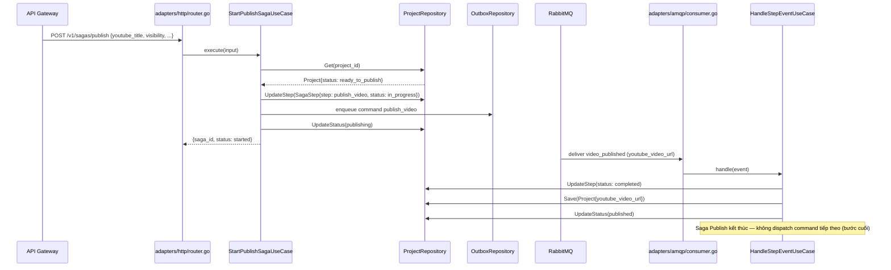

# Sequence Flows — Unit 8: Orchestrator Service

## Flow 1: Start Render Saga

## Flow 2: Successful Step — Classify Scenes (mid-Saga)

## Flow 3: Per-Scene Progress (scene_rendered — không advance state machine)

## Flow 4: Step Failure — Compensating Action (Retry, không rollback)

## Flow 5: Retry Failed Step

## Flow 6: Unexpected/Out-of-Order Event (Question 5's safeguard)

## Flow 7: Successful Publish Saga

