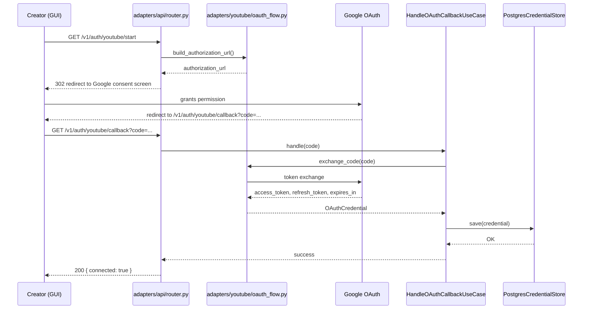
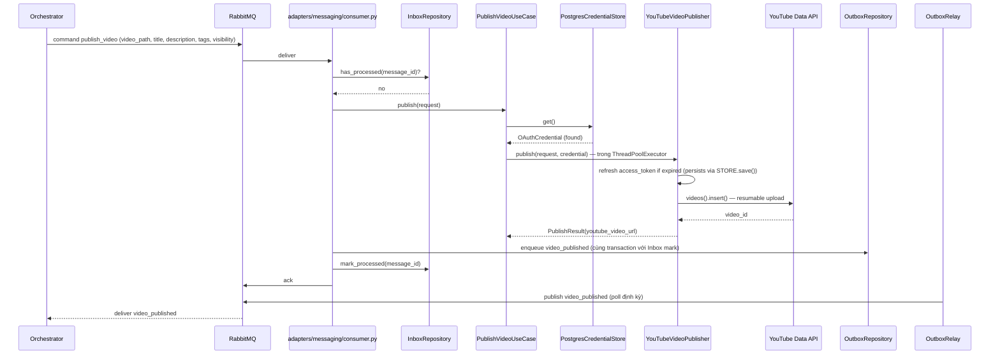
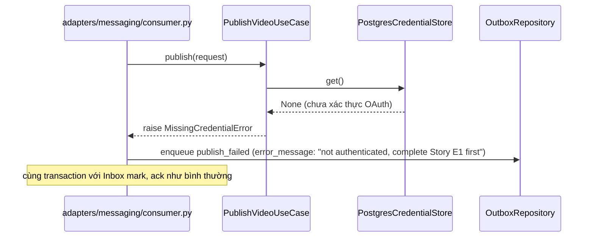
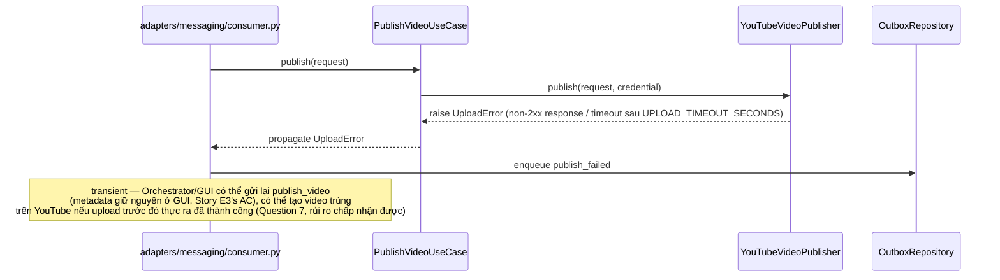

# Sequence Flows — Unit 7: Publisher Service

## Flow 1: OAuth Authentication (REST, ngoài Saga, Story E1)

## Flow 2: Successful Publish (AMQP, trong Saga, Story E3)

## Flow 3: Publish Failure — Missing Credential

## Flow 4: Publish Failure — Upload Error (Network/Timeout)

## Flow 5: Idempotent Redelivery (Message-Level, Inbox)
Giống Unit 2/3/4/5/6 — `message_id` đã xử lý (requeue) → `InboxRepository.has_processed()` trả `true` → ack ngay, không publish lại event, không upload lại.
