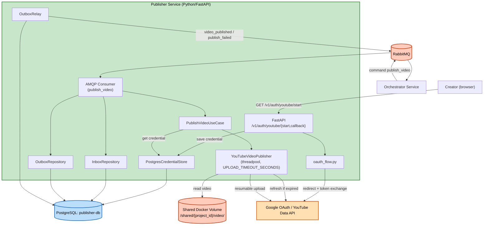

# Logical Components — Unit 7: Publisher Service

## Components
| Component | Type | Purpose |
|---|---|---|
| FastAPI app | REST server | `/v1/auth/youtube/{start,callback}`, `/health` |
| AMQP Consumer (`aio-pika`) | Message consumer | Nhận `publish_video` (queue `publisher.commands`) |
| `oauth_flow.py` | OAuth 2.0 wrapper | `google-auth-oauthlib`'s Authorization Code flow |
| `YouTubeVideoPublisher` | Upload engine wrapper | Implement `VideoPublisherPort`, resumable upload trong threadpool, `UPLOAD_TIMEOUT_SECONDS`, proactive token refresh |
| `PostgresCredentialStore` | Persistence adapter | Implement `CredentialStorePort`, đọc/ghi `oauth_credentials` (1 row, plaintext — ADR-0016) |
| Shared Docker Volume | File storage | Đọc video .mp4 output (từ Unit 6), read-only cho unit này |
| PostgreSQL (`publisher-db`) | Database | `outbox_events`/`processed_messages` (ADR-0013) + `oauth_credentials` |
| `InboxRepository`/`OutboxRepository` | Persistence adapter | Dedupe message + enqueue event (1 row/command, cùng transaction với Inbox mark) |
| `OutboxRelay` | Background poller | Publish event chưa gửi tới `orchestrator.events` |

## No External Infrastructure Components
Không cần cache ngoài (Redis), không cần circuit breaker riêng.

## Diagram

