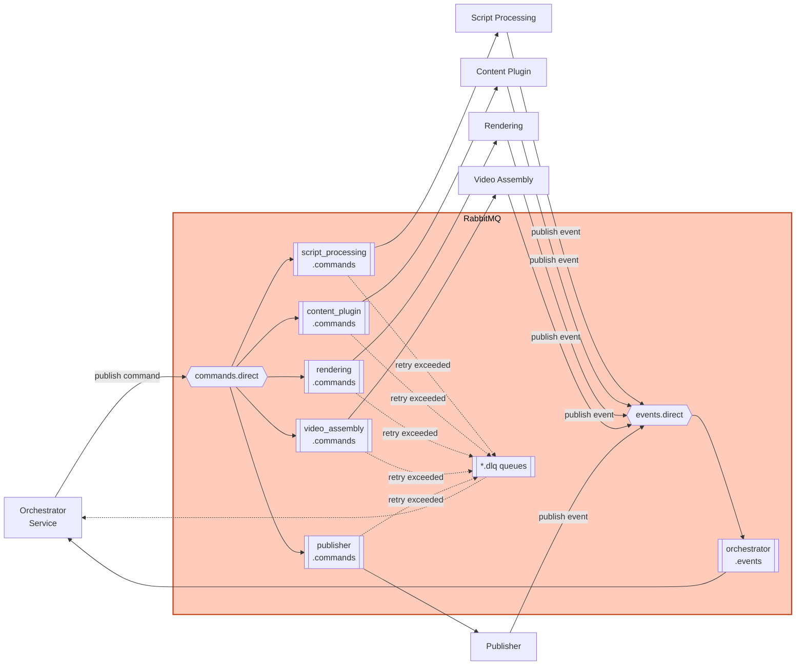

# Logical Components — Unit 1: RabbitMQ Infrastructure

## Exchange Topology (Direct Exchange — theo NFR Design Question 2)

### Command Exchange: `commands.direct`
| Routing Key | Bound Queue | Consumer |
|---|---|---|
| `script_processing` | `script_processing.commands` | Script Processing Service (Unit 4) |
| `content_plugin` | `content_plugin.commands` | Content Plugin Service (Unit 2) |
| `rendering` | `rendering.commands` | Rendering Service (Unit 5) |
| `video_assembly` | `video_assembly.commands` | Video Assembly Service (Unit 6) |
| `publisher` | `publisher.commands` | Publisher Service (Unit 7) |

### Event Exchange: `events.direct`
| Routing Key | Bound Queue | Consumer |
|---|---|---|
| `orchestrator` | `orchestrator.events` | Orchestrator Service (Unit 8) |

Tất cả 6 service nghiệp vụ (bao gồm TTS Service, ADR-0014) đều publish event vào `events.direct` với routing key `orchestrator` — event type nằm trong message payload (không phải routing key), vì chỉ có 1 consumer (Orchestrator).

### Progress Exchange: `progress.fanout` (MỚI — Revision, Unit 8 Low-Level Design Question 4, ADR-0017)
Type `fanout`, không pre-declare queue nào (Gateway, Unit 9, sẽ tự khai báo + bind queue riêng khi khởi động). Orchestrator Service (Unit 8) publish progress message (project_id, step, status, scene_index?, scene_total?, error_message?) vào exchange này sau mỗi lần xử lý event Saga — Gateway subscribe để forward qua SSE cho GUI (Story C6). Dùng fanout (không phải direct/topic) vì chỉ có 1 consumer thực tế (Gateway) và không cần routing key phân biệt — Gateway tự lọc theo `project_id` trong payload để định tuyến tới đúng SSE client.

## Dead-Letter Topology
Mỗi queue command có DLQ riêng, cấu hình qua `x-dead-letter-exchange` + `x-dead-letter-routing-key`:

| Queue | DLQ |
|---|---|
| `script_processing.commands` | `script_processing.commands.dlq` |
| `content_plugin.commands` | `content_plugin.commands.dlq` |
| `rendering.commands` | `rendering.commands.dlq` |
| `video_assembly.commands` | `video_assembly.commands.dlq` |
| `publisher.commands` | `publisher.commands.dlq` |

Orchestrator Service consume tất cả DLQ (qua 1 consumer chung lắng nghe pattern `*.dlq`, hoặc 5 consumer riêng — quyết định cụ thể ở Low-Level Design của Unit 8).

## Queue Configuration (áp dụng cho mọi queue command)
```
durable: true
arguments:
  x-message-ttl: 86400000        # 24h in ms
  x-dead-letter-exchange: "dlx.direct"
  x-dead-letter-routing-key: "<queue-name>.dlq"
```

## Diagram


