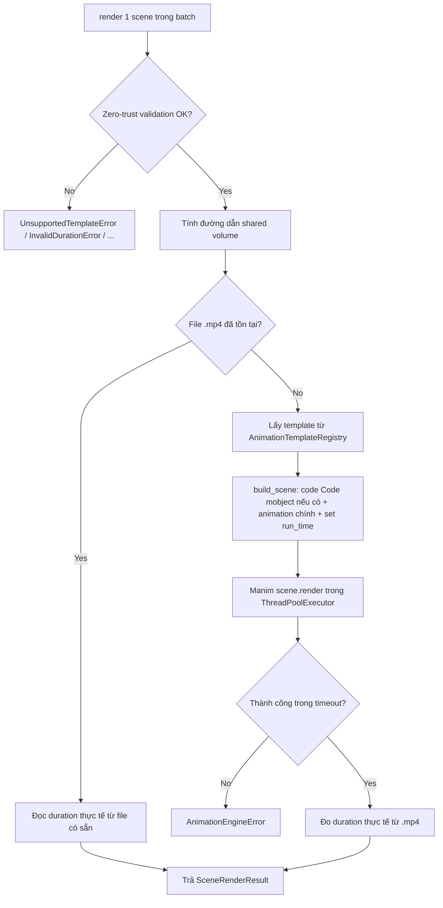

# Business Logic Model — Unit 5: Rendering Service

## Core Process: Render Scene

**Trigger**: `RenderSceneUseCase.render(request)`, gọi bởi `RenderScenesBatchUseCase` khi xử lý command AMQP `render_scenes` (mỗi scene trong batch).

**Steps**:
1. Validate zero-trust toàn bộ input (Business Rule 1) — vi phạm → raise lỗi tương ứng ngay (`UnsupportedTemplateError`/`InvalidDurationError`/lỗi rỗng trường bắt buộc).
2. Tính đường dẫn artifact quy ước: `/shared/{project_id}/animations/{scene_index}.mp4` (qua `artifact_paths.py`).
3. Kiểm tra file đã tồn tại (Business Rule 5 — idempotency).
   - Nếu tồn tại: đọc `duration_seconds` thực tế từ file, trả `SceneRenderResult` ngay, **bỏ qua bước 4-6**.
4. Lấy template từ `AnimationTemplateRegistry` theo `animation_template_id` (đã validate ở bước 1).
5. Template `build_scene(request)`:
   a. Nếu có `code_snippet`: dựng Manim `Code` mobject với `code_language` (hoặc `TextLexer` nếu không xác định được — Business Rule 4), đặt cố định góc trái, xuyên suốt scene (Business Rule 3).
   b. Dựng phần animation minh họa chính (thuật toán/khái niệm, chi tiết cụ thể theo từng template).
   c. Set `run_time` để khớp `duration_seconds` (Business Rule 2) — thêm `self.wait()` nếu animation tự nhiên ngắn hơn; giữ nguyên (dài hơn audio) nếu animation tự nhiên dài hơn.
6. `ManimAnimationRenderer` chạy `scene.render()` trong `ThreadPoolExecutor`, timeout `RENDER_TIMEOUT_SECONDS` — vượt timeout hoặc Manim crash → `AnimationEngineError`.
7. Đo `duration_seconds` thực tế từ file `.mp4` vừa ghi.
8. Trả `SceneRenderResult(animation_path, duration_seconds)`.

## Scope Boundary
Rendering Service CHỈ sinh animation clip câm (không âm thanh), đồng bộ thời lượng với audio đã có sẵn (FR4.3). Việc ghép audio vào video là trách nhiệm Video Assembly Service (Unit 6, FR5.1) — Rendering Service không tạo file có âm thanh.

## Business Process Diagram

