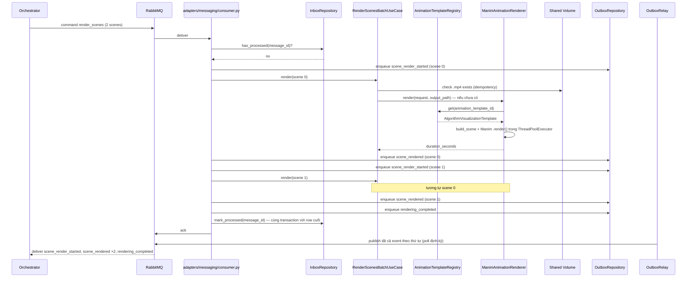

# Sequence Flows — Unit 5: Rendering Service

## Flow 1: Successful Batch Render (2 scenes)



## Flow 2: Fail-Fast at Scene 1 (Manim Error)

```mermaid
sequenceDiagram
    participant ORCH as Orchestrator
    participant MQ as RabbitMQ
    participant CONSUMER as adapters/messaging/consumer.py
    participant UC as RenderScenesBatchUseCase
    participant RENDERER as ManimAnimationRenderer
    participant OUTBOX as OutboxRepository
    participant RELAY as OutboxRelay

    ORCH->>MQ: command render_scenes (3 scenes)
    MQ->>CONSUMER: deliver
    CONSUMER->>OUTBOX: enqueue scene_render_started (scene 0)
    CONSUMER->>UC: render(scene 0) — thành công
    CONSUMER->>OUTBOX: enqueue scene_rendered (scene 0)

    CONSUMER->>OUTBOX: enqueue scene_render_started (scene 1)
    CONSUMER->>UC: render(scene 1)
    UC->>RENDERER: render(...)
    RENDERER-->>UC: raise AnimationEngineError (timeout sau RENDER_TIMEOUT_SECONDS)
    UC-->>CONSUMER: BatchRenderFailure(scene_index=1, error_message)

    CONSUMER->>OUTBOX: enqueue rendering_failed (scene_index=1) — KHÔNG xử lý scene 2
    CONSUMER->>MQ: ack (không retry nội bộ — mirror TTS/Unit4)
    RELAY->>MQ: publish scene_render_started(0), scene_rendered(0), scene_render_started(1), rendering_failed
    MQ-->>ORCH: deliver các event trên
    Note over ORCH: project status = failed_at_render_scenes;<br/>Orchestrator có thể retry command render_scenes
```

## Flow 3: Idempotent Retry After Fix (Artifact-Level, Question 7)
Orchestrator gửi lại `render_scenes` (cùng payload, `message_id` MỚI — không bị Inbox chặn). Với scene 0 (đã render thành công lần trước): `RenderSceneUseCase` kiểm tra file `.mp4` đã tồn tại → trả kết quả ngay, KHÔNG render lại, vẫn publish `scene_render_started`+`scene_rendered` (để GUI thấy tiến trình đầy đủ) nhưng bỏ qua bước Manim thực sự. Với scene 1 (lỗi lần trước, chưa có file): render lại từ đầu. Đây chính là cơ chế "retry không làm lại từ đầu" — khớp compensating action đã thiết kế ở `services.md`.

## Flow 4: Idempotent Redelivery (Message-Level, Inbox)
Giống Unit 2/3/4 — `message_id` đã xử lý (requeue) → `InboxRepository.has_processed()` trả `true` → ack ngay, không publish lại bất kỳ event nào.
