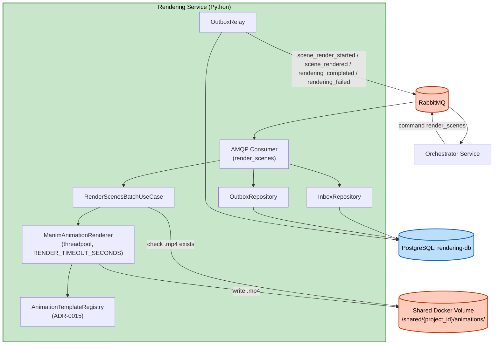

# Logical Components — Unit 5: Rendering Service

## Components
| Component | Type | Purpose |
|---|---|---|
| AMQP Consumer (`aio-pika`) | Message consumer | Nhận `render_scenes` (queue `rendering.commands`) |
| `AnimationTemplateRegistry` | In-process registry | Dynamic discovery template plugin (ADR-0015), load 1 lần lúc khởi động |
| `ManimAnimationRenderer` | Animation engine wrapper | Implement `AnimationRendererPort`, chạy Manim trong threadpool, `RENDER_TIMEOUT_SECONDS` |
| Shared Docker Volume | File storage | Lưu animation clip `.mp4`, cơ chế idempotency artifact-level |
| PostgreSQL (`rendering-db`) | Database | `outbox_events`/`processed_messages` (ADR-0013) |
| `InboxRepository`/`OutboxRepository` | Persistence adapter | Dedupe message + enqueue event (per-scene commit riêng, xem `nfr-design-patterns.md`) |
| `OutboxRelay` | Background poller | Publish event chưa gửi tới `orchestrator.events` |

## No External Infrastructure Components
Không cần cache ngoài (Redis), không cần circuit breaker riêng.

## Diagram

