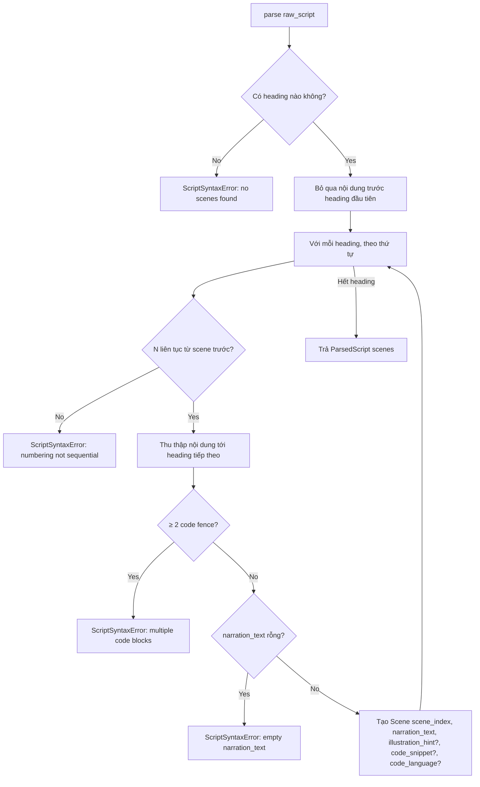

# Business Logic Model — Unit 4: Script Processing Service

## Core Process: Parse Script

**Trigger**: `ParseScriptUseCase.parse(raw_script)`, gọi bởi AMQP consumer khi nhận command `parse_script`.

**Steps** (`MarkdownScriptParser`, implement `ScriptParserPort`):
1. Quét toàn bộ `raw_script` theo dòng, tìm heading khớp pattern `## Scene N`.
2. Nếu không tìm thấy heading nào → raise `ScriptSyntaxError` (Rule 1).
3. Với mỗi heading tìm thấy, theo thứ tự xuất hiện:
   a. Kiểm tra N liên tục từ heading trước (bắt đầu từ 1) — vi phạm → raise `ScriptSyntaxError` (Rule 2).
   b. Thu thập nội dung từ sau heading này tới heading tiếp theo (hoặc hết file):
      - Dòng bắt đầu bằng `> ` → `illustration_hint` (Rule 4, optional — lấy dòng đầu tiên nếu có nhiều dòng blockquote).
      - Code fence (```` ``` ````...```` ``` ````) → `code_snippet`, ngôn ngữ khai báo sau dấu mở → `code_language` (Rule 8); nếu gặp code fence thứ 2 trong cùng scene → raise `ScriptSyntaxError` (Rule 5).
      - Các dòng còn lại (không phải blockquote, không nằm trong code fence) → nối thành `narration_text`.
   c. Validate `narration_text` không rỗng sau strip — vi phạm → raise `ScriptSyntaxError` (Rule 3).
   d. Tạo `Scene(scene_index=N-1, narration_text, illustration_hint, code_snippet, code_language)`.
4. Nội dung trước heading đầu tiên bị bỏ qua (Rule 6).
5. Parser dừng ngay ở lỗi đầu tiên gặp phải (Rule 7, fail-fast).
6. Trả về `ParsedScript(scenes=[...])` nếu không có lỗi.

## Scope Boundary
Script Processing Service CHỈ parse cú pháp thành cấu trúc scene (FR2.2) — KHÔNG gọi Content Plugin Service để gắn category (ADR-0012, Orchestrator điều phối bước đó riêng), KHÔNG lưu trữ script hay kết quả parse (stateless, NFR Requirements).

## Business Process Diagram


