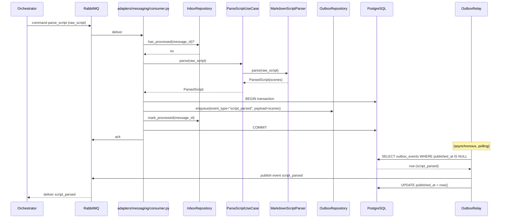
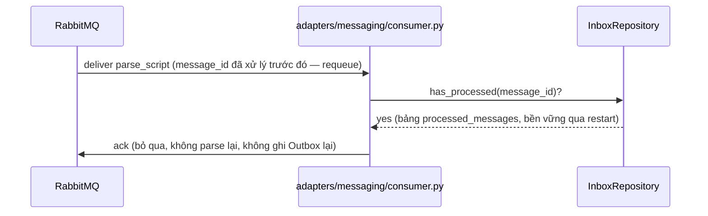

# Sequence Flows — Unit 4: Script Processing Service

**Revision (2026-08-07, ADR-0013)**: Flows dưới đây cập nhật theo Inbox/Outbox pattern (PostgreSQL) — publish event không còn trực tiếp từ consumer, mà qua `OutboxRelay`.

## Flow 1: Successful Parse



## Flow 2: Script Syntax Error

```mermaid
sequenceDiagram
    participant ORCH as Orchestrator
    participant MQ as RabbitMQ
    participant CONSUMER as adapters/messaging/consumer.py
    participant UC as ParseScriptUseCase
    participant PARSER as MarkdownScriptParser
    participant OUTBOX as OutboxRepository
    participant RELAY as OutboxRelay

    ORCH->>MQ: command parse_script (raw_script cú pháp lỗi)
    MQ->>CONSUMER: deliver
    CONSUMER->>UC: parse(raw_script)
    UC->>PARSER: parse(raw_script)
    PARSER-->>UC: raise ScriptSyntaxError(line_number, reason)
    UC-->>CONSUMER: propagate ScriptSyntaxError
    CONSUMER->>OUTBOX: enqueue(event_type="parse_failed", payload={line_number, reason})<br/>+ mark_processed(message_id), cùng transaction
    CONSUMER->>MQ: ack (không retry — lỗi cần Creator sửa script)
    RELAY->>MQ: publish event parse_failed (poll định kỳ)
    MQ-->>ORCH: deliver parse_failed
    Note over ORCH: Orchestrator đặt project status = failed_at_parse_script;<br/>GUI hiển thị lỗi + vị trí (Story A2 AC)
```

## Flow 3: Idempotent Redelivery



## Flow 4: Outbox Relay Restart Recovery
Nếu service crash sau khi COMMIT transaction (Outbox đã ghi) nhưng trước khi Relay kịp publish, không có dữ liệu mất — row vẫn còn `published_at IS NULL` trong DB, Relay tiếp tục publish khi service khởi động lại (đây chính là điểm khác biệt cốt lõi so với `IdempotencyStore` in-memory trước đây, vốn mất toàn bộ state khi restart).

**Note — luồng tổng thể sau Unit 4** (theo `services.md`, ADR-0012): sau khi `script_parsed` được Orchestrator nhận, Orchestrator điều phối bước Saga tiếp theo (`classify_scenes` tới Content Plugin Service, Unit 2) — nằm ngoài phạm vi Unit 4, xem lại khi phát triển Unit 8 (Orchestrator).
