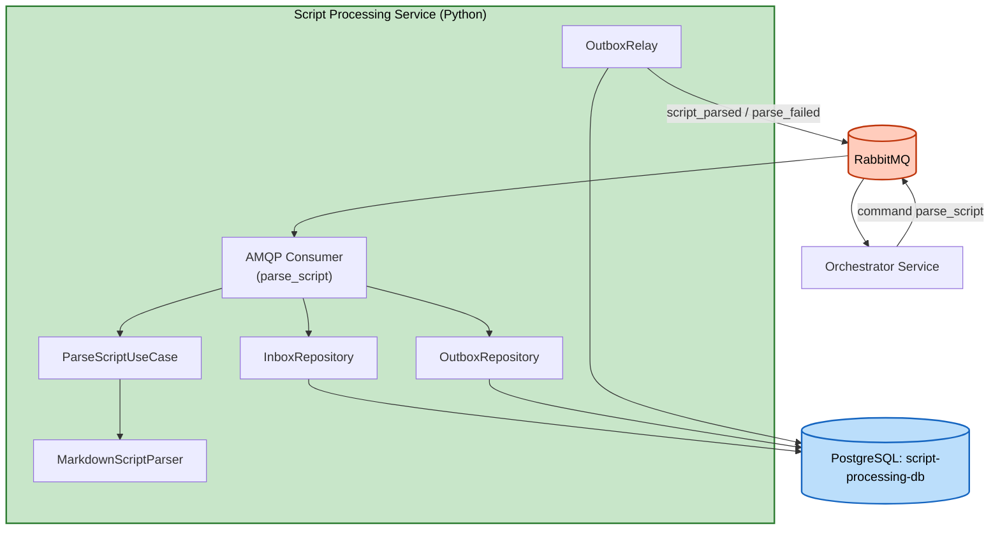

# Logical Components — Unit 4: Script Processing Service

## Components
| Component | Type | Purpose |
|---|---|---|
| AMQP Consumer (`aio-pika`) | Message consumer | Nhận `parse_script` (queue `script_processing.commands`), auto-reconnect built-in |
| `MarkdownScriptParser` | In-process parser | Implement `ScriptParserPort`, parse cú pháp Markdown (ADR-0011) |
| PostgreSQL (`script-processing-db`) | Database | `outbox_events`/`processed_messages` (ADR-0013) |
| `InboxRepository`/`OutboxRepository` | Persistence adapter | Dedupe message + enqueue event, transactional |
| `OutboxRelay` | Background poller | Publish event chưa gửi tới `orchestrator.events` |

## No External Infrastructure Components
Không cần cache (không có gì để cache), không cần circuit breaker riêng (chỉ 2 dependency hạ tầng: RabbitMQ, PostgreSQL — cả hai đều có cơ chế resilience built-in tương ứng của `aio-pika`/`asyncpg`).

## Diagram

