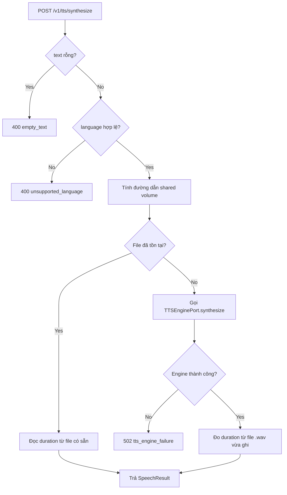

# Business Logic Model — Unit 3: TTS Service

## Core Process: Synthesize Speech

**Trigger**: `POST /v1/tts/synthesize` (gọi bởi Rendering Service, đồng bộ, trong phạm vi bước Saga `render_scenes`)

**Steps** (`SynthesizeSpeechUseCase`):
1. Validate `text` không rỗng (Business Rule 1) — nếu rỗng, raise `EmptyTextError`.
2. Validate `language` thuộc `{"vi", "en"}` (Business Rule 2) — nếu không hợp lệ, raise `UnsupportedLanguageError`.
3. Tính đường dẫn artifact quy ước: `/shared/{project_id}/audio/{scene_index}_{language}.wav` (qua `artifact_paths.py`).
4. Kiểm tra file đã tồn tại tại đường dẫn đó (Business Rule 4 — idempotency).
   - Nếu tồn tại: đọc `duration_seconds` từ file có sẵn, trả `SpeechResult` ngay, **bỏ qua bước 5-6**.
   - Nếu không tồn tại: tiếp tục bước 5.
5. Gọi `TTSEnginePort.synthesize(text, language, output_path)` — text truyền nguyên văn (Business Rule 3), engine (Piper, ADR-0010) ghi file `.wav` vào `output_path`.
   - Nếu engine lỗi (crash/timeout): raise `TTSEngineError`.
6. Đo `duration_seconds` từ file `.wav` vừa ghi (Business Rule 5 — đọc metadata `wave` module, làm tròn 2 chữ số thập phân).
7. Trả `SpeechResult(audio_path, duration_seconds)`.

## Scope Boundary
TTS Service chỉ chịu trách nhiệm sinh audio + đo thời lượng chính xác (FR4.1, FR4.2). Việc đồng bộ animation với thời lượng audio (FR4.3, Story C3) là trách nhiệm của Rendering Service (Unit 5) — TTS Service chỉ cung cấp `duration_seconds` làm input cho bước đó, không tự thực hiện đồng bộ.

## Business Process Diagram

