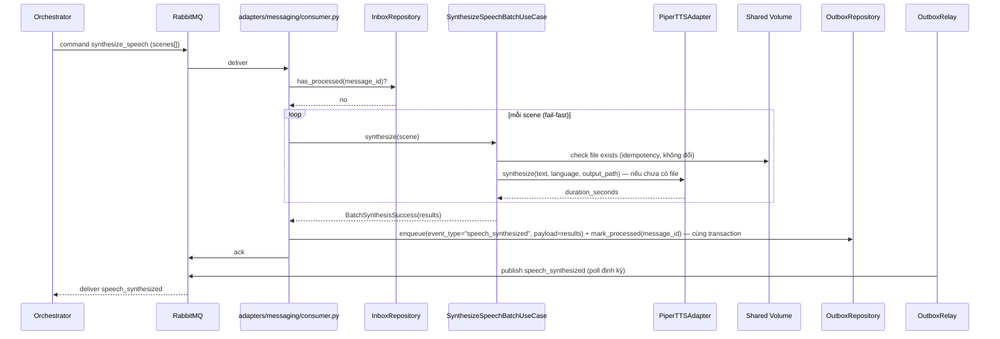
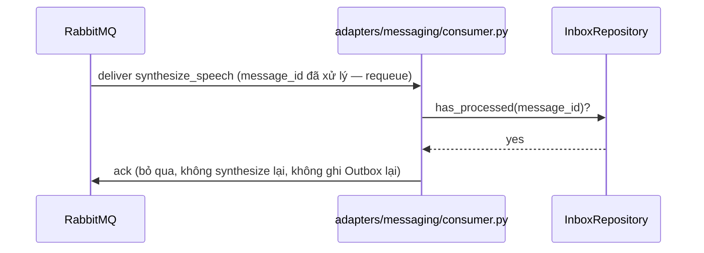

# Sequence Flows — Unit 3: TTS Service

**Revision (2026-08-07, ADR-0014, ADR-0013)**: Flows below replace the previous REST-based flows — TTS Service is now message-driven with its own Saga step, and publishing goes through Outbox + OutboxRelay (mirrors Unit 2/Unit 4's pattern).

## Flow 1: Successful Batch Synthesis



## Flow 2: Engine Failure (Transient)

```mermaid
sequenceDiagram
    participant ORCH as Orchestrator
    participant MQ as RabbitMQ
    participant CONSUMER as adapters/messaging/consumer.py
    participant UC as SynthesizeSpeechBatchUseCase
    participant ENGINE as PiperTTSAdapter
    participant OUTBOX as OutboxRepository
    participant RELAY as OutboxRelay

    ORCH->>MQ: command synthesize_speech (scenes[])
    MQ->>CONSUMER: deliver
    CONSUMER->>UC: synthesize(scenes)
    UC->>ENGINE: synthesize(...) — scene N
    ENGINE-->>UC: raise TTSEngineError (timeout/crash)
    UC-->>CONSUMER: BatchSynthesisFailure(error_message="tts_engine_failure: ...")
    CONSUMER->>OUTBOX: enqueue(event_type="synthesis_failed", payload={error_message}) + mark_processed — cùng transaction
    CONSUMER->>MQ: ack (không retry nội bộ — NFR Design Question 2, không đổi)
    RELAY->>MQ: publish synthesis_failed
    MQ-->>ORCH: deliver synthesis_failed
    Note over ORCH: project status = failed_at_synthesize_speech;<br/>Orchestrator có thể retry toàn bộ command (transient error)
```

## Flow 3: Idempotent Redelivery (Message-Level, Inbox)



## Flow 4: Idempotent Retry (Artifact-Level, không đổi từ Functional Design)
Nếu Orchestrator gửi lại `synthesize_speech` với `message_id` MỚI nhưng cùng `project_id`+`scene_index` (retry sau khi sửa lỗi ở bước khác) — Inbox không chặn (message_id khác), nhưng `SynthesizeSpeechUseCase` vẫn kiểm tra file `.wav` đã tồn tại (Business Rule 4, không đổi) → trả kết quả có sẵn, không synthesize lại. Đây chính là cơ chế "retry không làm lại từ đầu" mà 2 tầng idempotency (message-level + artifact-level) cùng đảm bảo.
