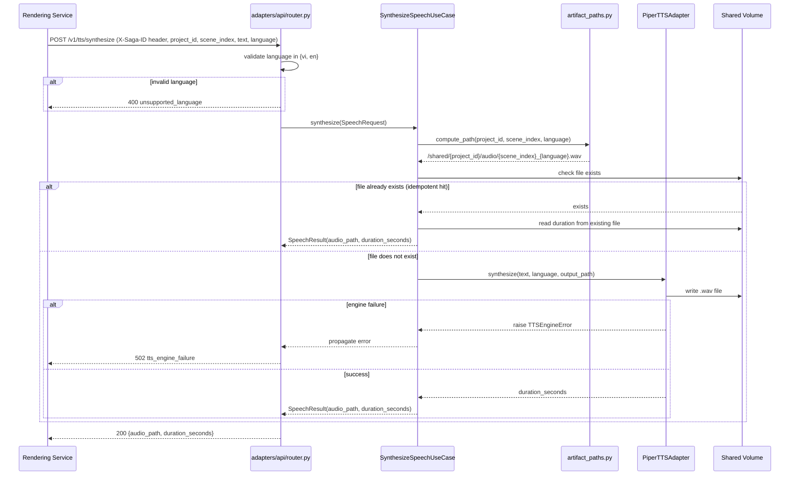
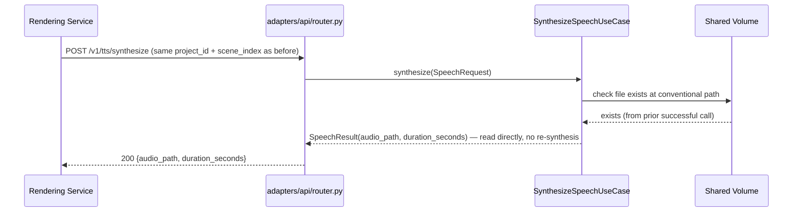

# Sequence Flows — Unit 3: TTS Service

## Flow 1: Synthesize Speech (New Audio)

## Flow 2: Idempotent Retry (Rendering Service retries after transient failure elsewhere in the scene pipeline)

**Note**: Flow 2 covers the case where `render_scenes` step fails downstream (e.g., another scene fails) and Orchestrator/Rendering Service retries only the failing scene, per the compensating-action strategy in `services.md`. TTS Service never re-synthesizes audio it has already produced for a given `project_id`+`scene_index`.
