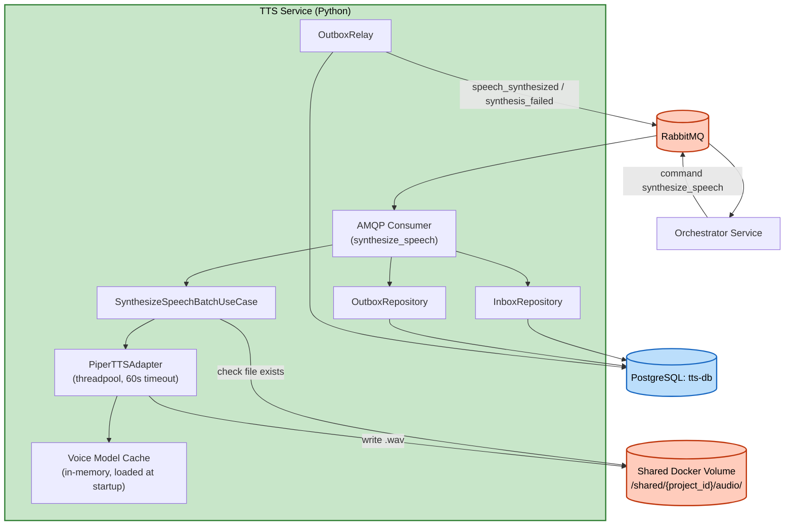

# Logical Components — Unit 3: TTS Service

**Revision (2026-08-07, ADR-0014, ADR-0013)**: FastAPI/REST replaced by AMQP consumer/producer; PostgreSQL (Inbox/Outbox) added.

## Components
| Component | Type | Purpose |
|---|---|---|
| AMQP Consumer (`aio-pika`) | Message consumer | Nhận `synthesize_speech` (queue `tts.commands`), auto-reconnect built-in |
| `PiperTTSAdapter` | In-process TTS engine wrapper | Implement `TTSEnginePort`, chạy synthesis trong threadpool, 60s timeout nội bộ — không đổi |
| Voice model in-process cache | In-memory dict (`language -> model instance`) | Không đổi |
| Shared Docker Volume | File storage | Lưu file audio `.wav`, cơ chế idempotency artifact-level — không đổi |
| PostgreSQL (`tts-db`) | Database | `outbox_events`/`processed_messages` (ADR-0013) |
| `InboxRepository`/`OutboxRepository` | Persistence adapter | Dedupe message + enqueue event, transactional |
| `OutboxRelay` | Background poller | Publish event chưa gửi tới `orchestrator.events` |

## No External Infrastructure Components
Không cần cache ngoài (Redis), không cần circuit breaker riêng. **Đổi**: nay CÓ database (Postgres, ADR-0013) và CÓ tham gia RabbitMQ (ADR-0014) — trước đây cả hai đều "N/A".

## Diagram

