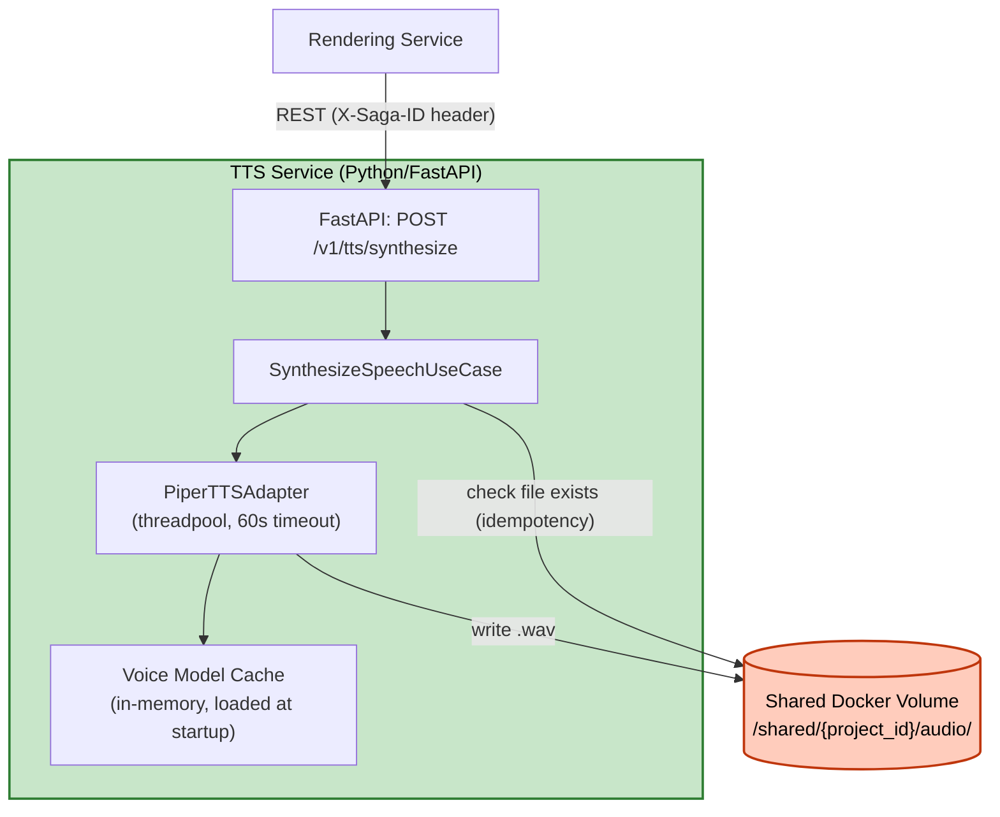

# Logical Components — Unit 3: TTS Service

## Components
| Component | Type | Purpose |
|---|---|---|
| FastAPI app | HTTP server | Expose `POST /v1/tts/synthesize` |
| `PiperTTSAdapter` | In-process TTS engine wrapper | Implement `TTSEnginePort`, chạy synthesis trong threadpool, 60s timeout nội bộ |
| Voice model in-process cache | In-memory dict (`language -> model instance`) | Tránh load lại Piper voice model mỗi request; load eager lúc startup |
| Shared Docker Volume | File storage (bên ngoài process) | Lưu file audio `.wav`, đồng thời là cơ chế idempotency (kiểm tra tồn tại file) |

## No External Infrastructure Components
Không cần cache ngoài (Redis), không cần database, không cần message broker (không tham gia RabbitMQ), không cần circuit breaker riêng (không gọi service ngoài nào — leaf node duy nhất phụ thuộc là engine TTS local + file system).

## Diagram

