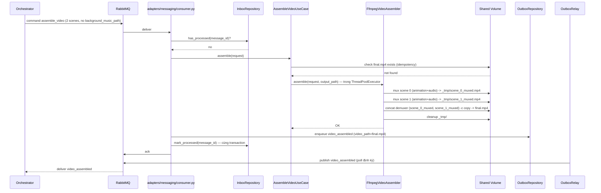
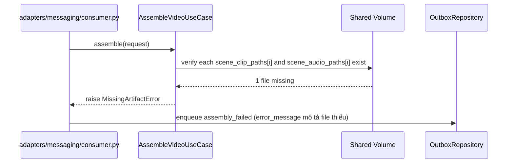

# Sequence Flows — Unit 6: Video Assembly Service

## Flow 1: Successful Assembly, No Background Music (2 scenes)



## Flow 2: Successful Assembly, With Background Music

```mermaid
sequenceDiagram
    participant UC as AssembleVideoUseCase
    participant ASM as FfmpegVideoAssembler
    participant FS as Shared Volume

    UC->>ASM: assemble(request incl. background_music_path, output_path)
    ASM->>FS: per-scene mux (mirror Flow 1)
    ASM->>FS: concat demuxer -c copy -> _tmp/concatenated.mp4
    ASM->>FS: overlay background_music_path (volume=0.2, amix, -stream_loop -1 -shortest) -> final.mp4
    Note over ASM: video track giữ nguyên (-c:v copy); chỉ audio track re-encode
    ASM->>FS: cleanup _tmp/
    ASM-->>UC: OK
```

## Flow 3: Assembly Failure (ffmpeg Error/Timeout)

```mermaid
sequenceDiagram
    participant ORCH as Orchestrator
    participant MQ as RabbitMQ
    participant CONSUMER as adapters/messaging/consumer.py
    participant UC as AssembleVideoUseCase
    participant ASM as FfmpegVideoAssembler
    participant OUTBOX as OutboxRepository
    participant RELAY as OutboxRelay

    ORCH->>MQ: command assemble_video
    MQ->>CONSUMER: deliver
    CONSUMER->>UC: assemble(request)
    UC->>ASM: assemble(request, output_path)
    ASM-->>UC: raise AssemblyEngineError (non-zero exit / timeout ASSEMBLY_TIMEOUT_SECONDS)
    UC-->>CONSUMER: AssemblyFailure(error_message)

    CONSUMER->>OUTBOX: enqueue assembly_failed (cùng transaction với Inbox mark)
    CONSUMER->>MQ: ack (không retry nội bộ — mirror Unit 2/3/4/5)
    RELAY->>MQ: publish assembly_failed
    MQ-->>ORCH: deliver assembly_failed
    Note over ORCH: project status = failed_at_assemble_video;<br/>animation/audio clip giữ nguyên;<br/>Orchestrator có thể retry command assemble_video
```

## Flow 4: Missing Artifact (Input Validation)



## Flow 5: Idempotent Retry After Fix (Artifact-Level, Question 7)
Orchestrator gửi lại `assemble_video` (cùng payload, `message_id` MỚI — không bị Inbox chặn). `AssembleVideoUseCase` kiểm tra `/shared/{project_id}/video/final.mp4` đã tồn tại → trả kết quả ngay (publish `video_assembled` với path đã có), KHÔNG chạy lại ffmpeg. Đây là cơ chế "retry không làm lại từ đầu" — khớp compensating action đã thiết kế ở `services.md`.

## Flow 6: Idempotent Redelivery (Message-Level, Inbox)
Giống Unit 2/3/4/5 — `message_id` đã xử lý (requeue) → `InboxRepository.has_processed()` trả `true` → ack ngay, không publish lại event.
