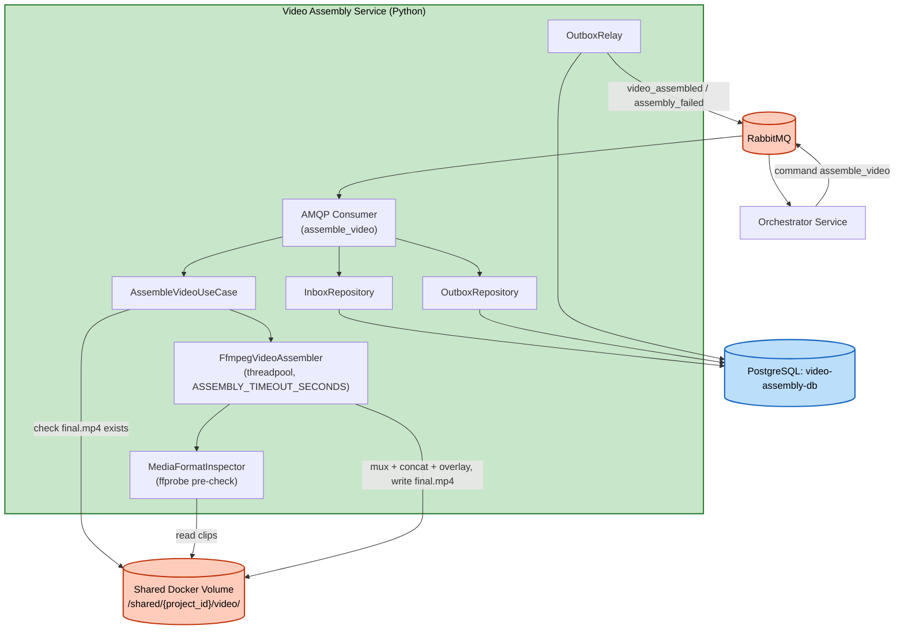

# Logical Components — Unit 6: Video Assembly Service

## Components
| Component | Type | Purpose |
|---|---|---|
| AMQP Consumer (`aio-pika`) | Message consumer | Nhận `assemble_video` (queue `video_assembly.commands`) |
| `MediaFormatInspector` | ffprobe wrapper | Pre-check codec/resolution/framerate đồng nhất giữa các animation clip (Functional Design Question 3) |
| `FfmpegVideoAssembler` | Assembly engine wrapper | Implement `VideoAssemblerPort`, chạy ffmpeg (mux → concat → overlay nhạc nền) trong threadpool, `ASSEMBLY_TIMEOUT_SECONDS` |
| Shared Docker Volume | File storage | Đọc animation clip + audio clip input, ghi file trung gian `_tmp/` + video output `final.mp4`, cơ chế idempotency artifact-level |
| PostgreSQL (`video-assembly-db`) | Database | `outbox_events`/`processed_messages` (ADR-0013) |
| `InboxRepository`/`OutboxRepository` | Persistence adapter | Dedupe message + enqueue event (1 row/command, cùng transaction với Inbox mark) |
| `OutboxRelay` | Background poller | Publish event chưa gửi tới `orchestrator.events` |

## No External Infrastructure Components
Không cần cache ngoài (Redis), không cần circuit breaker riêng.

## Diagram

