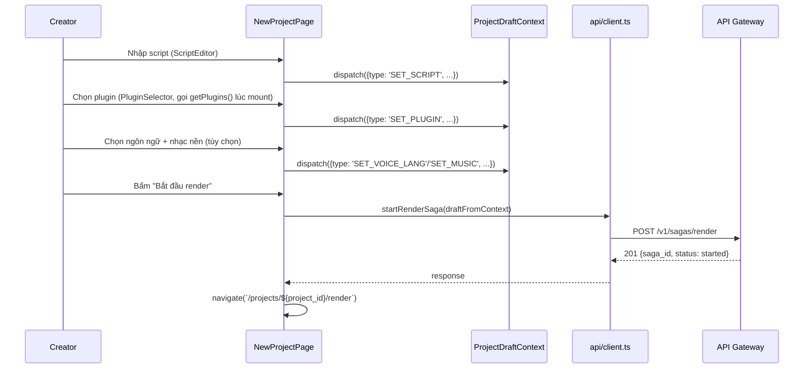
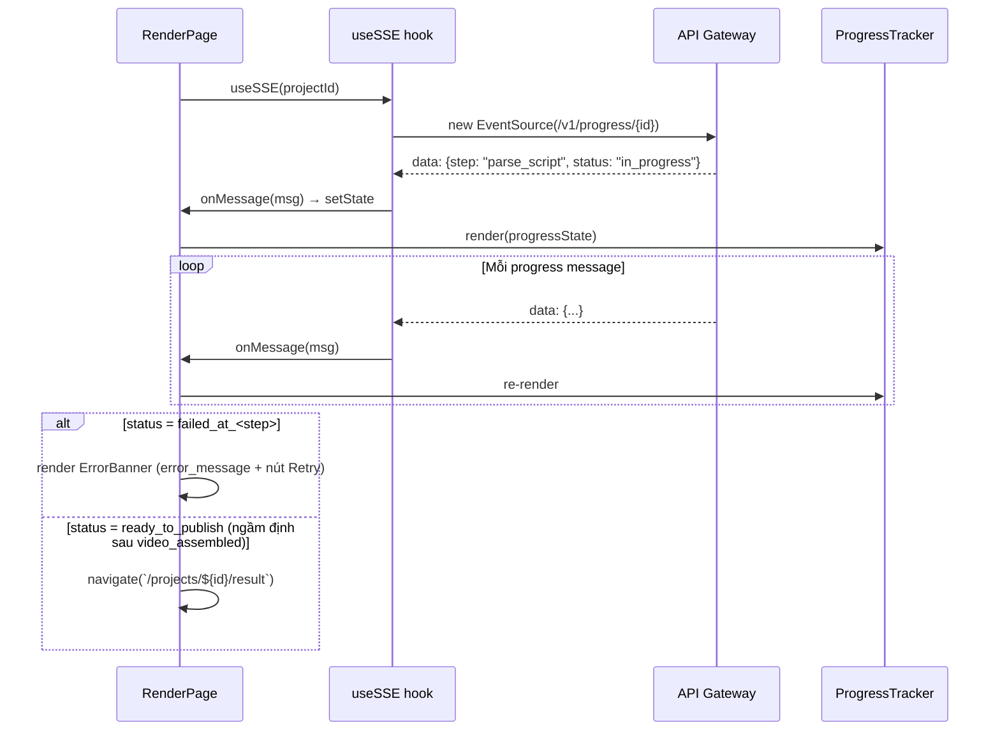
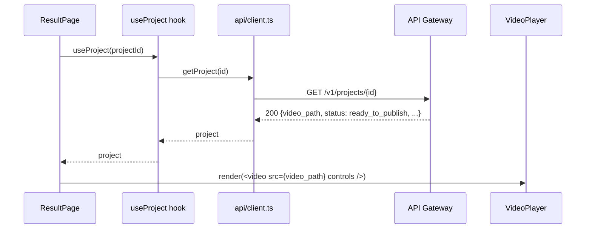
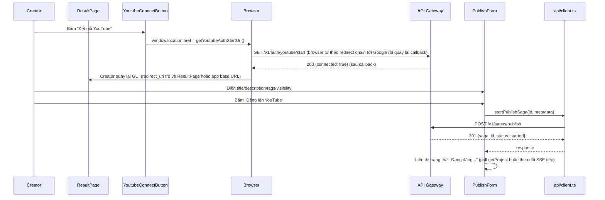
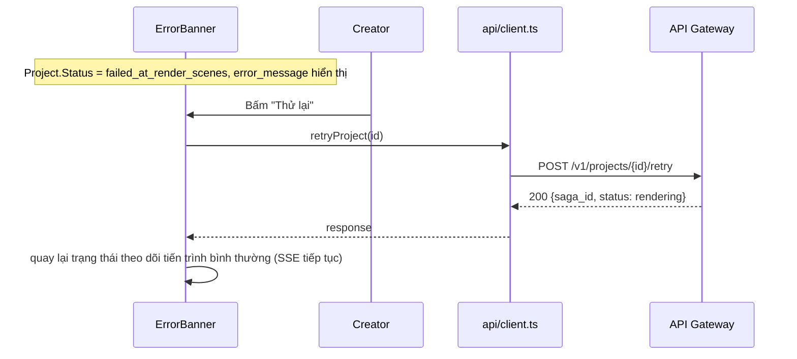

# Sequence Flows — Unit 10: Web GUI

## Flow 1: Soạn Project + Khởi chạy Render (Epic A/B, Story C1)

## Flow 2: Theo dõi Tiến trình qua SSE (Story C6)

## Flow 3: Xem Kết quả + Phát Video (Story D1)

## Flow 4: Kết nối YouTube + Đăng Video (Story E1/E2/E3)

## Flow 5: Xử lý Lỗi + Retry (Question 7)

