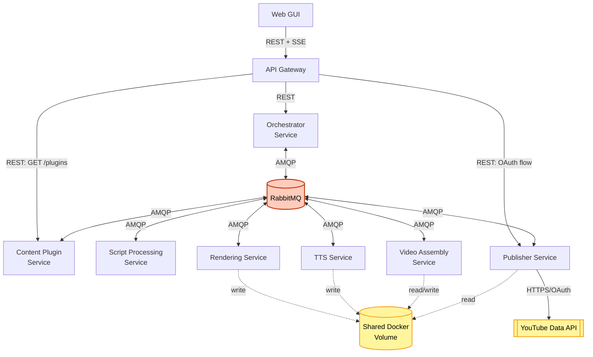

# Component Dependency

**Cập nhật theo ADR-0007**: Orchestrator Service + RabbitMQ thêm vào graph; các service nghiệp vụ nay phụ thuộc RabbitMQ thay vì gọi trực tiếp REST tới Gateway/nhau (trừ các luồng REST ngoài Saga).

**Revision (2026-08-07, ADR-0014)**: Rendering↔TTS REST (dòng/edge dưới đây) đã bị loại bỏ — TTS Service nay message-driven hoàn toàn qua RabbitMQ, không còn ngoại lệ REST nào trong phạm vi Saga.

## Dependency Matrix

| Component | Depends On | Communication |
|---|---|---|
| Web GUI | API Gateway | REST (sync) + SSE (server push) |
| API Gateway | Orchestrator Service | REST (sync, khởi tạo Saga + truy vấn trạng thái) |
| API Gateway | Content Plugin Service | REST (sync, chỉ cho `GET /plugins`, ngoài Saga) |
| API Gateway | Publisher Service | REST (sync, chỉ cho luồng OAuth, ngoài Saga) |
| Orchestrator Service | RabbitMQ | AMQP (publish command / consume event) |
| Script Processing Service | RabbitMQ | AMQP (consume command / publish event) |
| Content Plugin Service | RabbitMQ | AMQP (consume command / publish event) |
| Rendering Service | RabbitMQ | AMQP (consume command / publish event) |
| Video Assembly Service | RabbitMQ | AMQP (consume command / publish event) |
| Publisher Service | RabbitMQ | AMQP (consume command / publish event) |
| TTS Service | RabbitMQ | AMQP (consume command / publish event) — ADR-0014 |
| Rendering Service | Shared Docker Volume | File I/O (ghi animation clip) |
| TTS Service | Shared Docker Volume | File I/O (ghi audio clip) |
| Video Assembly Service | Shared Docker Volume | File I/O (đọc clip, ghi video hoàn chỉnh) |
| Publisher Service | Shared Docker Volume | File I/O (đọc video hoàn chỉnh) |
| Publisher Service | YouTube Data API (external) | HTTPS/OAuth 2.0 |

## Dependency Graph

## Coupling Notes
- Không có dependency vòng (circular dependency) giữa các service.
- **RabbitMQ là điểm phụ thuộc chung** của Orchestrator và mọi service nghiệp vụ trong Saga — đây là điểm hạ tầng quan trọng nhất cần đảm bảo hoạt động ổn định (single point of failure tiềm ẩn dù chạy local; cần cấu hình restart policy trong docker-compose).
- Content Plugin Service có 2 kiểu giao tiếp khác nhau: REST trực tiếp từ Gateway (`GET /plugins`, ngoài Saga) và AMQP command từ Orchestrator (`classify_scenes`, trong Saga) — cần lưu ý khi thiết kế service này để tách rõ 2 luồng.
- Shared Docker Volume là "dependency ngầm" giữa Rendering/TTS/Video Assembly/Publisher — có thể thay bằng object storage (S3/MinIO) sau này (theo Application Design Q1) mà không ảnh hưởng domain core (Hexagonal).
