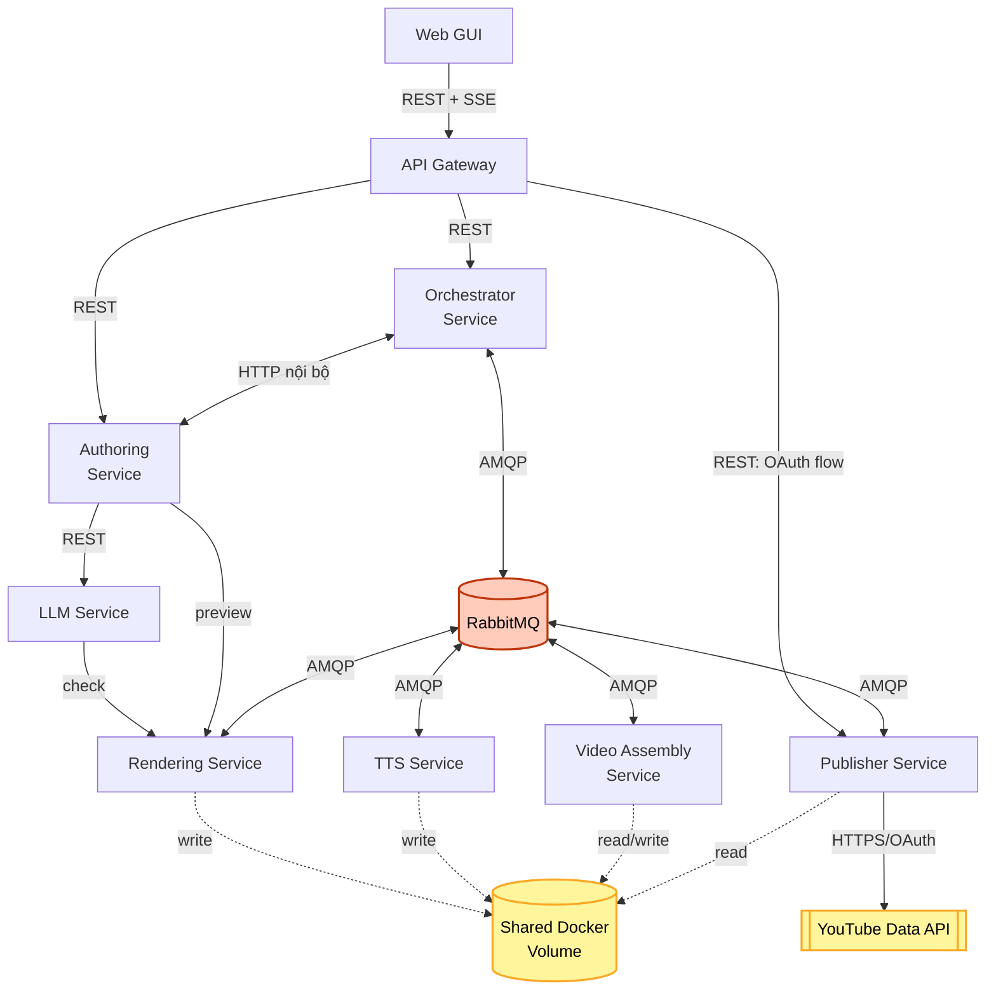

# Component Dependency

**Cập nhật theo ADR-0007**: Orchestrator Service + RabbitMQ thêm vào graph; các service nghiệp vụ nay phụ thuộc RabbitMQ thay vì gọi trực tiếp REST tới Gateway/nhau (trừ các luồng REST ngoài Saga).

**Revision (2026-08-07, ADR-0014)**: Rendering↔TTS REST (dòng/edge dưới đây) đã bị loại bỏ — TTS Service nay message-driven hoàn toàn qua RabbitMQ, không còn ngoại lệ REST nào trong phạm vi Saga.

**Cập nhật (CR-055, 2026-09-30)**: Content Plugin Service (gỡ ở CR-020) và Script Processing Service (gỡ ở CR-040) không còn; thêm Authoring Service (CR-040, ADR-0029) và LLM Service (CR-039). Nội dung dưới đây theo hệ đang chạy.

## Dependency Matrix

| Component | Depends On | Communication |
|---|---|---|
| Web GUI | API Gateway | REST (sync) + SSE (server push) |
| API Gateway | Orchestrator Service | REST (sync, khởi tạo Saga + truy vấn trạng thái) |
| API Gateway | Authoring Service | REST (sync, soạn kịch bản, prompt, hình minh hoạ) |
| API Gateway | Publisher Service | REST (sync, chỉ cho luồng OAuth, ngoài Saga) |
| Orchestrator Service | RabbitMQ | AMQP (publish command / consume event) |
| Orchestrator Service ↔ Authoring Service | — | HTTP nội bộ hai chiều (ADR-0029), không `depends_on` |
| Authoring Service | LLM Service | REST (sync) |
| Authoring Service, LLM Service | Rendering Service | REST nội bộ (`/v1/check/*`, `/v1/illustrations/preview`) |
| LLM Service | Hive API (external) / Ollama | HTTPS / HTTP (OpenAI SDK) |
| Rendering Service | RabbitMQ | AMQP (consume command / publish event) |
| Video Assembly Service | RabbitMQ | AMQP (consume command / publish event) |
| Publisher Service | RabbitMQ | AMQP (consume command / publish event) |
| TTS Service | RabbitMQ | AMQP (consume command / publish event) — ADR-0014 |
| Rendering Service | Shared Docker Volume | File I/O (ghi animation clip) |
| TTS Service | Shared Docker Volume | File I/O (ghi audio clip) |
| Video Assembly Service | Shared Docker Volume | File I/O (đọc clip, ghi video hoàn chỉnh) |
| Publisher Service | Shared Docker Volume | File I/O (đọc video hoàn chỉnh) |
| Publisher Service | YouTube Data API (external) | HTTPS/OAuth 2.0 |

## Dependency Graph

```mermaid
flowchart TB
    GUI["Web GUI"]
    GW["API Gateway"]
    ORCH["Orchestrator<br/>Service"]
    MQ[("RabbitMQ")]
    AU["Authoring<br/>Service"]
    LLM["LLM Service"]
    RD["Rendering Service"]
    TTS["TTS Service"]
    VA["Video Assembly<br/>Service"]
    PB["Publisher Service"]
    VOL[("Shared Docker<br/>Volume")]
    YT[["YouTube Data API"]]

    GUI -->|REST + SSE| GW
    GW -->|REST| ORCH
    GW -->|REST| AU
    ORCH <-->|HTTP nội bộ| AU
    AU -->|REST| LLM
    LLM -->|check| RD
    AU -->|preview| RD
    GW -->|REST: OAuth flow| PB

    ORCH <-->|AMQP| MQ
    MQ <-->|AMQP| RD
    MQ <-->|AMQP| TTS
    MQ <-->|AMQP| VA
    MQ <-->|AMQP| PB

    RD -.->|write| VOL
    TTS -.->|write| VOL
    VA -.->|read/write| VOL
    PB -.->|read| VOL
    PB -->|HTTPS/OAuth| YT

    style VOL fill:#FFF59D,stroke:#F9A825,stroke-width:2px,color:#000
    style YT fill:#FFF59D,stroke:#F9A825,stroke-width:2px,color:#000
    style MQ fill:#FFCCBC,stroke:#BF360C,stroke-width:2px,color:#000
```

## Coupling Notes
- Không có dependency vòng (circular dependency) giữa các service.
- **RabbitMQ là điểm phụ thuộc chung** của Orchestrator và mọi service nghiệp vụ trong Saga — đây là điểm hạ tầng quan trọng nhất cần đảm bảo hoạt động ổn định (single point of failure tiềm ẩn dù chạy local; cần cấu hình restart policy trong docker-compose).
- Rendering Service có 2 kiểu giao tiếp: AMQP command từ Orchestrator (trong Saga) và REST nội bộ từ LLM/Authoring Service (kiểm biên dịch, preview) — cùng một tiến trình, giới hạn đồng thời bằng `CHECK_CONCURRENCY`.
- Orchestrator và Authoring Service gọi nhau hai chiều qua HTTP nhưng không phải vòng phụ thuộc lúc khởi động: mỗi bên tự suy giảm khi bên kia down (ADR-0029).
- Shared Docker Volume là "dependency ngầm" giữa Rendering/TTS/Video Assembly/Publisher — có thể thay bằng object storage (S3/MinIO) sau này (theo Application Design Q1) mà không ảnh hưởng domain core (Hexagonal).
