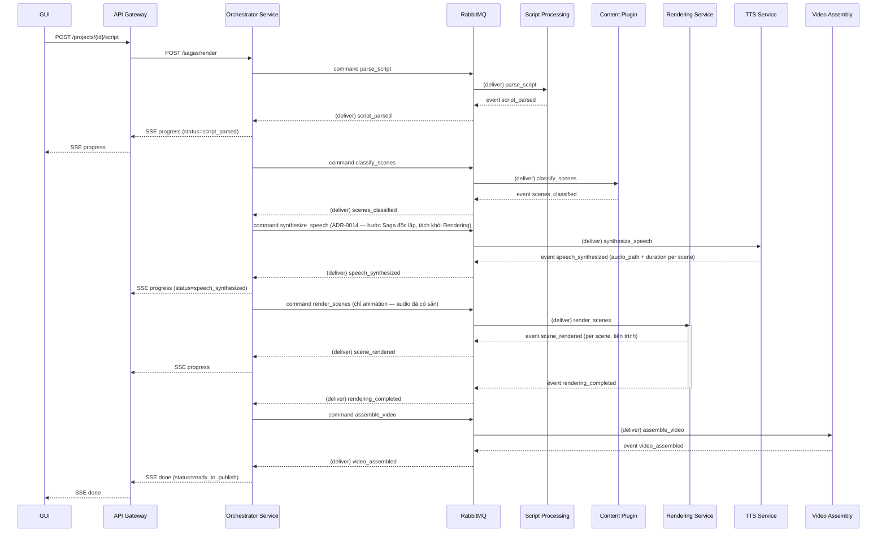
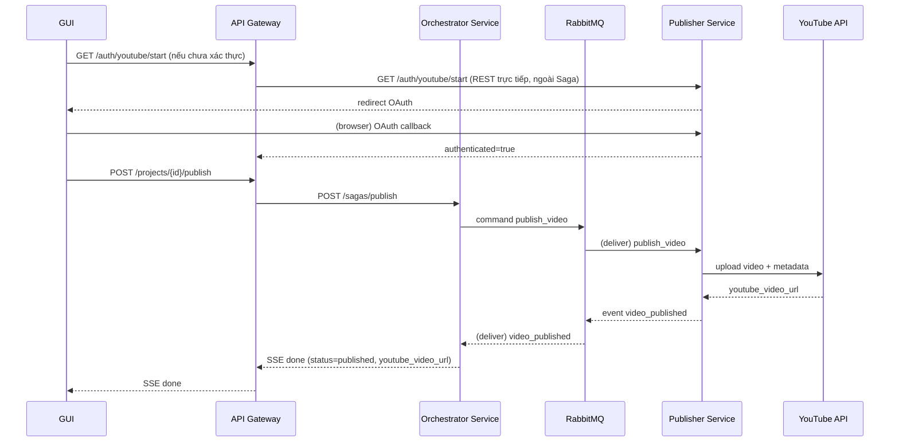

# Services (Orchestration Layer)

**Cập nhật theo ADR-0007**: Orchestration Service (mới) là Saga coordinator duy nhất, giao tiếp với các service nghiệp vụ qua RabbitMQ (command/event, bất đồng bộ). API Gateway chỉ còn routing + khởi tạo Saga qua REST.

**Revision (2026-08-07, ADR-0014)**: TTS Service ban đầu được gọi trực tiếp qua REST đồng bộ bên trong bước "Render Scenes". Theo ADR-0014, TTS Service nay là **bước Saga độc lập** ("Synthesize Speech"), tách khỏi Rendering Service hoàn toàn — Rendering Service không còn gọi TTS. Saga Step Definitions và sequence diagram bên dưới đã cập nhật theo quyết định này.

## Saga: Render Pipeline (Story A1 → D1)

## Saga: Publish (Story E1 → E3)

## Saga Step Definitions

| # | Step | Command | Service | Success Event | Failure Event |
|---|---|---|---|---|---|
| 1 | Parse Script | `parse_script` | Script Processing | `script_parsed` | `parse_failed` |
| 2 | Classify Scenes | `classify_scenes` | Content Plugin | `scenes_classified` | `classification_failed` |
| 3 | Synthesize Speech | `synthesize_speech` | TTS (ADR-0014 — bước độc lập, không còn gọi từ Rendering) | `speech_synthesized` | `synthesis_failed` |
| 4 | Render Scenes | `render_scenes` | Rendering (chỉ animation — audio đã có sẵn từ bước 3) | `rendering_completed` | `rendering_failed` |
| 5 | Assemble Video | `assemble_video` | Video Assembly | `video_assembled` | `assembly_failed` |
| 6 | Publish Video | `publish_video` | Publisher | `video_published` | `publish_failed` |

## Error Handling & Compensating Actions (Saga Orchestration, ADR-0007)
- Khi Orchestrator nhận event `*_failed`, đặt trạng thái project = `failed_at_<step>`, giữ nguyên kết quả các bước trước (artifact đã tạo trong shared volume không bị xóa).
- **Compensating action** cụ thể theo bước:
  - `parse_failed`/`classification_failed`: không có artifact cần dọn — cho phép Creator sửa script và retry từ bước 1
  - `synthesis_failed`: giữ audio đã sinh thành công (idempotent theo `project_id`+`scene_index`, file trong shared volume), retry chỉ scene lỗi
  - `rendering_failed`: giữ scene đã render thành công (idempotent theo `project_id`+`scene_index`), retry chỉ scene lỗi
  - `assembly_failed`: giữ animation/audio clip, retry chỉ bước Assembly
  - `publish_failed`: không có gì cần rollback ở phía YouTube (chưa tạo gì), retry bước Publish
- GUI hiển thị lỗi cụ thể (Story C6) và nút retry tương ứng bước lỗi — Orchestrator chỉ gửi lại command của bước đó, không chạy lại toàn bộ Saga.
- **Idempotency**: mọi command mang `saga_id` + `project_id`; consumer kiểm tra artifact đã tồn tại trước khi tạo lại (tránh xử lý trùng khi message được deliver lại do requeue).
