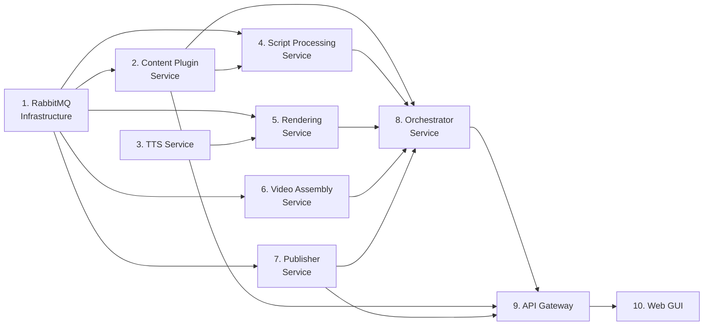

# Unit of Work Dependency

## Dependency Matrix

| Unit | Depends On | Reason |
|---|---|---|
| 1. RabbitMQ Infrastructure | — | Hạ tầng nền, không phụ thuộc unit khác |
| 2. Content Plugin Service | 1 | Consumer command `classify_scenes` qua RabbitMQ |
| 3. TTS Service | — | Chỉ expose REST nội bộ, không qua RabbitMQ, không phụ thuộc unit khác |
| 4. Script Processing Service | 1, 2 | Consumer command `parse_script` qua RabbitMQ; gọi Content Plugin Service |
| 5. Rendering Service | 1, 3 | Consumer command `render_scenes` qua RabbitMQ; gọi TTS Service (REST) |
| 6. Video Assembly Service | 1 | Consumer command `assemble_video` qua RabbitMQ |
| 7. Publisher Service | 1 | Consumer command `publish_video` qua RabbitMQ |
| 8. Orchestrator Service | 1, 2, 3, 4, 5, 6, 7 | Cần publish/consume message với tất cả service nghiệp vụ để test đầy đủ 2 Saga |
| 9. API Gateway | 2, 7, 8 | Proxy REST tới Orchestrator (khởi tạo Saga), Content Plugin (`GET /plugins`), Publisher (OAuth) |
| 10. Web GUI | 9 | Gọi REST/SSE tới API Gateway |

## Development Sequence (theo Question 2 — dependency-first)

**Thứ tự phát triển đề xuất**: Unit 1 → (Unit 2, Unit 3 song song — không phụ thuộc nhau) → Unit 4, Unit 6, Unit 7 (song song, đều chỉ phụ thuộc Unit 1 + tương ứng) → Unit 5 (sau Unit 3) → Unit 8 (sau khi 2,3,4,5,6,7 xong) → Unit 9 → Unit 10.

## Circular Dependency Check
Không có dependency vòng — đồ thị trên là DAG (Directed Acyclic Graph) hợp lệ, khớp với `component-dependency.md` ở Application Design.
