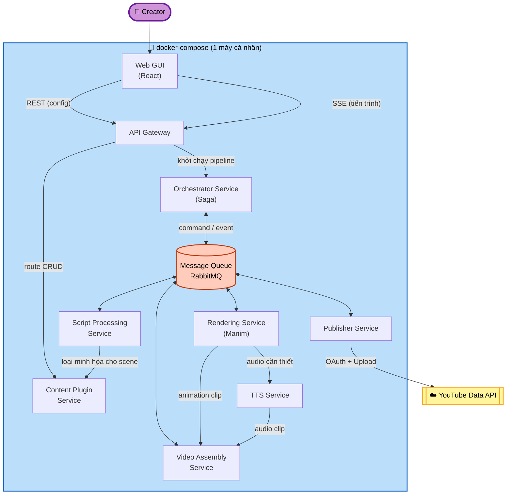

# Architecture Overview

## Macro Decomposition Decision
Hệ thống được tổ chức theo **Microservices**, mỗi service chạy trong container riêng qua docker-compose trên cùng một máy cá nhân. Xem ADR-0001 cho lý do và trade-off.

**Cập nhật (ADR-0007)**: Vai trò điều phối nghiệp vụ (orchestration) được tách khỏi API Gateway sang một **Orchestrator Service** riêng biệt, giao tiếp với các service nghiệp vụ qua **Message Queue (RabbitMQ)** theo mô hình **Saga orchestration-based**. Xem `integration-boundaries.md` để biết chi tiết.

## Major Components / Services

### 1. Web GUI
- **Trách nhiệm**: Giao diện web cho Creator — soạn script, chọn plugin/ngôn ngữ, khởi chạy render, theo dõi tiến trình (qua SSE), xem/preview video, cấu hình và kích hoạt đăng YouTube.
- **Không chịu trách nhiệm**: Không chứa business logic render/TTS/publish — mọi xử lý nghiệp vụ đều đi qua API Gateway/Orchestrator Service.

### 2. API Gateway
- **Trách nhiệm**: Điểm vào duy nhất cho GUI (REST + SSE); định tuyến (route) yêu cầu cấu hình đơn giản (CRUD-like) đến đúng backend service; với yêu cầu khởi chạy pipeline (render, publish), chuyển tiếp sang Orchestrator Service qua Message Queue; hợp nhất sự kiện tiến trình (nhận từ Orchestrator Service qua queue) thành luồng SSE cho GUI. Không chứa business process logic.
- Xem ADR-0004.

### 3. Orchestrator Service (MỚI — ADR-0007)
- **Trách nhiệm**: Điều phối luồng nghiệp vụ theo mô hình **Saga orchestration-based**. Là nơi duy nhất biết thứ tự các bước (Script → Plugin → Render+TTS → Assembly → Publish), gửi command message qua Message Queue tới từng service, nhận event message xác nhận hoàn tất/lỗi, cập nhật trạng thái "video project" (state machine), và kích hoạt **compensating action** khi một bước thất bại.
- **Không chịu trách nhiệm**: Không routing cho GUI (đó là việc của Gateway); không chứa business logic cụ thể của từng bước (đó là việc của service tương ứng).

### 4. Message Queue — RabbitMQ (MỚI — ADR-0007)
- **Vai trò**: Hạ tầng giao tiếp bất đồng bộ giữa Orchestrator Service và các service nghiệp vụ (Content Plugin, Script Processing, Rendering, TTS, Video Assembly, Publisher). Đảm bảo command không mất khi service tạm thời chậm/down, hỗ trợ retry/acknowledge.

### 5. Content Plugin Service
- **Trách nhiệm**: Quản lý các content-type plugin nạp động (FR1.1–FR1.3, ADR-0006); với plugin "Lập trình" hiện tại: xác định loại minh họa (thuật toán/cấu trúc dữ liệu hay khái niệm lập trình) cho từng scene (FR1.2, B1, B2).
- **Ranh giới mở rộng**: Đây là service hiện thực hóa NFR1 (Extensibility) — thêm domain giáo dục mới (vd. Tiếng Anh) nghĩa là thêm một plugin mới vào thư mục `plugins/` mà không đổi các service khác.

### 6. Script Processing Service
- **Trách nhiệm**: Nhận script/markdown thô (FR2.1) đã được Orchestrator Service chuyển tới, phân tích (parse) thành cấu trúc scene chuẩn hóa (lời thoại + điểm cần minh họa) (FR2.2), phối hợp với Content Plugin Service để gắn loại minh họa cho từng scene.

### 7. Rendering Service
- **Trách nhiệm**: Nhận cấu trúc scene đã phân tích, sinh animation Manim cho từng scene (FR3.1, FR3.2), đồng bộ thời lượng animation với audio giọng đọc tương ứng (FR4.3), phát event tiến trình qua Message Queue (Orchestrator Service forward tới Gateway → SSE) (FR6.1/Story C6).

### 8. TTS Service
- **Trách nhiệm**: Sinh giọng đọc từ lời thoại trong scene bằng TTS mã nguồn mở/offline, hỗ trợ song ngữ Việt/Anh (FR4.1, FR4.2).

### 9. Video Assembly Service
- **Trách nhiệm**: Ghép animation clip (từ Rendering Service) và audio (từ TTS Service) của tất cả scene thành một file video .mp4 hoàn chỉnh, tùy chọn thêm nhạc nền (FR5.1, FR5.2).

### 10. Publisher Service
- **Trách nhiệm**: Quản lý xác thực OAuth 2.0 với YouTube (FR7.3), nhận metadata video từ GUI (FR7.2, qua Orchestrator), tải video hoàn chỉnh lên YouTube (FR7.1).

## High-Level Architecture Diagram

