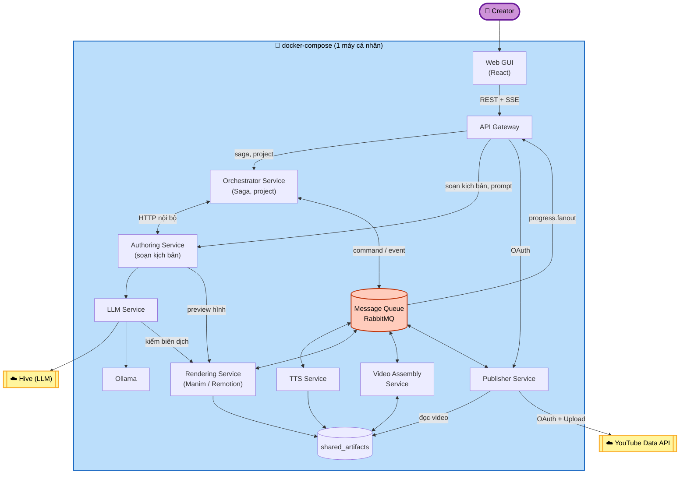

# Architecture Overview

## Macro Decomposition Decision
Hệ thống được tổ chức theo **Microservices**, mỗi service chạy trong container riêng qua docker-compose trên cùng một máy cá nhân. Xem ADR-0001 cho lý do và trade-off.

**Cập nhật (ADR-0007)**: Vai trò điều phối nghiệp vụ (orchestration) được tách khỏi API Gateway sang một **Orchestrator Service** riêng biệt, giao tiếp với các service nghiệp vụ qua **Message Queue (RabbitMQ)** theo mô hình **Saga orchestration-based**. Xem `integration-boundaries.md` để biết chi tiết.

## Hiện trạng (cập nhật CR-055, 2026-09-30)
Bộ service ban đầu (10 thành phần) đã thay đổi qua các CR:
- **Content Plugin Service** — gỡ ở CR-020 (bước phân loại scene không còn trong saga; ADR-0006, ADR-0012 chuyển `Superseded`).
- **Script Processing Service** — gỡ ở CR-040: việc tìm tên class Scene / composition id chuyển vào bước `validate_script` của Rendering Service (`services/rendering/domain/script_locator.py`).
- **Authoring Service** — thêm ở CR-040 (ADR-0029): tách phần soạn kịch bản khỏi Orchestrator.
- **LLM Service** + **Ollama** — thêm ở CR-039: nơi duy nhất gọi mô hình ngôn ngữ.

Mục dưới đây mô tả hệ thống đang chạy (`docker-compose.yml`).

## Major Components / Services

### 1. Web GUI (`services/web-gui`)
- **Trách nhiệm**: Giao diện web cho Creator — tạo project theo wizard, soạn kịch bản cùng AI (qua Authoring Service), duyệt, khởi chạy render, theo dõi tiến trình (SSE), xem/preview video, đăng YouTube, quản lý thư viện prompt/hình minh hoạ.
- **Không chịu trách nhiệm**: Không chứa business logic render/TTS/publish — mọi xử lý đi qua API Gateway.

### 2. API Gateway (`services/api-gateway`)
- **Trách nhiệm**: Điểm vào duy nhất cho GUI (REST + SSE, cổng 8080). Proxy REST tới Orchestrator (saga, project), Authoring Service (soạn kịch bản, prompt, hình minh hoạ) và Publisher (OAuth YouTube); tự phục vụ SSE tiến độ bằng cách nghe `progress.fanout` (ADR-0017). Không chứa business process logic. Xem ADR-0004, ADR-0020.

### 3. Orchestrator Service (`services/orchestrator`, Go — ADR-0007, ADR-0018)
- **Trách nhiệm**: Saga coordinator duy nhất và chủ sở hữu **project** (trạng thái, cấu hình, fork, huỷ/retry bước, channel asset, lỗi, xoá project). Gửi command qua RabbitMQ, nhận event, cập nhật state machine.
- **Không chịu trách nhiệm**: Không soạn kịch bản, không gọi LLM (đó là Authoring Service); không chứa logic cụ thể của từng bước.

### 4. Authoring Service (`services/authoring-service`, Go — ADR-0029)
- **Trách nhiệm**: Thư viện prompt, chuỗi soạn kịch bản (câu chuyện → storyboard → code), wizard, gợi ý metadata/short, thư viện và kế hoạch hình minh hoạ, nhật ký dùng LLM. DB riêng. Đọc dữ liệu project từ Orchestrator qua HTTP nội bộ; Orchestrator đọc trạng thái soạn qua `/internal/v1/authoring/*`.

### 5. LLM Service (`services/llm-service`, Python — CR-039)
- **Trách nhiệm**: Nơi duy nhất nói chuyện với mô hình ngôn ngữ (Hive qua OpenAI SDK, hoặc Ollama). Chạy pipeline sinh code chia đoạn (bố cục, shot song song, gộp, kiểm biên dịch qua Rendering, sửa). Không có DB.

### 6. Message Queue — RabbitMQ (ADR-0007)
- **Vai trò**: Giao tiếp bất đồng bộ giữa Orchestrator và các service xử lý media (TTS, Rendering, Video Assembly, Publisher); `progress.fanout` đưa tiến độ tới Gateway; `control.fanout` cho lệnh huỷ. Topology: `infra/rabbitmq/definitions.json`.

### 7. Rendering Service (`services/rendering`, Python)
- **Trách nhiệm**: Bước `validate_script` (tìm tên Scene/composition, chạy lượt dry) và `render_scenes` (Manim hoặc Remotion ra video câm + `timing.json`); render channel asset. Có HTTP nội bộ (`/v1/check/*`, `/v1/illustrations/preview`) cho LLM Service và Authoring Service.

### 8. TTS Service (`services/tts`, Python — ADR-0014, ADR-0024, ADR-0025)
- **Trách nhiệm**: Bước `synthesize_speech` — sinh giọng đọc cho từng cảnh (Edge, Azure; Google ngủ đông).

### 9. Video Assembly Service (`services/video-assembly`, Python)
- **Trách nhiệm**: Bước `assemble_video` (ghép video + audio + nhạc nền + phụ đề, intro/outro), `qc_video`, `generate_clips` (clip dọc), chuẩn hoá channel asset.

### 10. Publisher Service (`services/publisher`, Python — ADR-0016, ADR-0026, ADR-0028)
- **Trách nhiệm**: OAuth 2.0 với YouTube (nhiều app, nhiều kênh), bước `publish_video` (upload video, caption).

### Hạ tầng đi kèm
- Mỗi service có dữ liệu có Postgres riêng (ADR-0013): orchestrator, authoring-service, tts, rendering, video-assembly, publisher.
- Volume `shared_artifacts` (`/shared`): hợp đồng ở `docs/contracts/shared-artifacts.md`.
- Log tập trung: Loki + Promtail + Grafana (`infra/observability/`).

## High-Level Architecture Diagram

```mermaid
flowchart TB
    Creator(["👤 Creator"])

    subgraph Docker["🐳 docker-compose (1 máy cá nhân)"]
        GUI["Web GUI<br/>(React)"]
        GW["API Gateway"]
        ORCH["Orchestrator Service<br/>(Saga, project)"]
        AUTH["Authoring Service<br/>(soạn kịch bản)"]
        LLM["LLM Service"]
        OLLAMA["Ollama"]
        MQ[("Message Queue<br/>RabbitMQ")]
        RENDER["Rendering Service<br/>(Manim / Remotion)"]
        TTS["TTS Service"]
        ASSEMBLY["Video Assembly<br/>Service"]
        PUBLISH["Publisher Service"]
        VOL[("shared_artifacts")]
    end

    YT[["☁️ YouTube Data API"]]
    HIVE[["☁️ Hive (LLM)"]]

    Creator --> GUI
    GUI -- "REST + SSE" --> GW
    GW -- "saga, project" --> ORCH
    GW -- "soạn kịch bản, prompt" --> AUTH
    GW -- "OAuth" --> PUBLISH
    ORCH <-- "HTTP nội bộ" --> AUTH
    AUTH --> LLM
    LLM --> HIVE
    LLM --> OLLAMA
    LLM -- "kiểm biên dịch" --> RENDER
    AUTH -- "preview hình" --> RENDER
    ORCH <-- "command / event" --> MQ
    MQ <--> TTS
    MQ <--> RENDER
    MQ <--> ASSEMBLY
    MQ <--> PUBLISH
    MQ -- "progress.fanout" --> GW
    TTS --> VOL
    RENDER --> VOL
    ASSEMBLY <--> VOL
    PUBLISH -- "đọc video" --> VOL
    PUBLISH -- "OAuth + Upload" --> YT

    style Docker fill:#BBDEFB,stroke:#1565C0,stroke-width:2px,color:#000
    style Creator fill:#CE93D8,stroke:#6A1B9A,stroke-width:3px,color:#000
    style YT fill:#FFF59D,stroke:#F9A825,stroke-width:2px,color:#000
    style HIVE fill:#FFF59D,stroke:#F9A825,stroke-width:2px,color:#000
    style MQ fill:#FFCCBC,stroke:#BF360C,stroke-width:2px,color:#000
```
