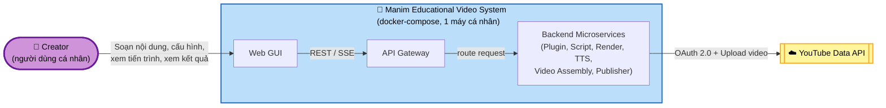

# System Context

## External Actors
- **Creator** (persona duy nhất, xem `personas.md`) — người dùng cá nhân tương tác trực tiếp với hệ thống qua GUI web để soạn nội dung, cấu hình, khởi chạy render, xem kết quả, và đăng video.

## External Systems
- **YouTube Data API (Google)** — hệ thống bên ngoài duy nhất mà hệ thống tích hợp, dùng để xác thực OAuth 2.0 và tự động tải video đã render lên kênh YouTube của Creator (FR7).

Không có hệ thống bên ngoài nào khác (đã xác nhận: TTS chạy offline nội bộ, không dùng cloud storage ngoài, không dùng dịch vụ TTS cloud).

## System Boundary
Toàn bộ hệ thống — GUI, các microservice backend (Plugin/Content, Script Processing, Rendering, TTS, Video Assembly, Publishing), và API Gateway — chạy trong **docker-compose trên một máy cá nhân** duy nhất, do Creator vận hành trực tiếp. Ranh giới hệ thống là toàn bộ tập hợp container này; điểm giao tiếp duy nhất vượt ra ngoài ranh giới là kết nối HTTPS đến YouTube Data API.

## Context Diagram

