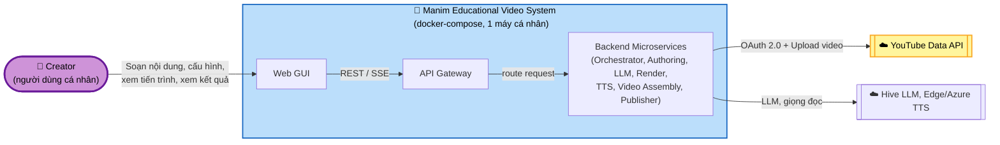

# System Context

## External Actors
- **Creator** (persona duy nhất, xem `personas.md`) — người dùng cá nhân tương tác trực tiếp với hệ thống qua GUI web để soạn nội dung, cấu hình, khởi chạy render, xem kết quả, và đăng video.

## External Systems
- **YouTube Data API (Google)** — xác thực OAuth 2.0 và tải video lên kênh YouTube của Creator (FR7).

**Cập nhật (CR-055)**: ràng buộc ban đầu "không dịch vụ cloud nào khác" đã thay đổi. Hiện có thêm:
- **Hive API** — mô hình ngôn ngữ cho soạn kịch bản, chỉ LLM Service gọi (CR-039). Ollama là lựa chọn chạy local.
- **Edge Read Aloud**, **Azure Speech** (tuỳ chọn), **Google Cloud TTS** (ngủ đông) — engine giọng đọc của TTS Service (ADR-0023, 0024, 0025).

## System Boundary
Toàn bộ hệ thống — GUI, API Gateway, các microservice backend (Orchestrator, Authoring, LLM, Rendering, TTS, Video Assembly, Publisher), Ollama, RabbitMQ, Postgres và log tập trung — chạy trong **docker-compose trên một máy cá nhân** duy nhất, do Creator vận hành trực tiếp. Ranh giới hệ thống là toàn bộ tập hợp container này; kết nối vượt ra ngoài ranh giới là HTTPS tới các hệ thống bên ngoài nêu trên.

## Context Diagram

```mermaid
flowchart LR
    Creator(["👤 Creator<br/>(người dùng cá nhân)"])

    subgraph System["🐳 Manim Educational Video System<br/>(docker-compose, 1 máy cá nhân)"]
        GUI["Web GUI"]
        GW["API Gateway"]
        Services["Backend Microservices<br/>(Orchestrator, Authoring, LLM, Render,<br/>TTS, Video Assembly, Publisher)"]
    end

    YouTube[["☁️ YouTube Data API"]]
    Cloud[["☁️ Hive LLM, Edge/Azure TTS"]]

    Creator -- "Soạn nội dung, cấu hình,<br/>xem tiến trình, xem kết quả" --> GUI
    GUI -- "REST / SSE" --> GW
    GW -- "route request" --> Services
    Services -- "OAuth 2.0 + Upload video" --> YouTube
    Services -- "LLM, giọng đọc" --> Cloud

    style Creator fill:#CE93D8,stroke:#6A1B9A,stroke-width:3px,color:#000
    style YouTube fill:#FFF59D,stroke:#F9A825,stroke-width:2px,color:#000
    style System fill:#BBDEFB,stroke:#1565C0,stroke-width:2px,color:#000
```
