# Execution Plan

## Detailed Analysis Summary

### Change Impact Assessment
- **User-facing changes**: Có — toàn bộ hệ thống là sản phẩm mới, GUI là điểm chạm chính (Epic A-E trong stories.md)
- **Structural changes**: Có — dự án greenfield, cần thiết kế kiến trúc hệ thống hoàn toàn mới (plugin boundary, core pipeline, GUI)
- **Data model changes**: Có — cần mô hình hóa dự án video, scene, script, cấu hình plugin, metadata YouTube
- **API changes**: Có — cần định nghĩa contract giữa GUI ↔ core pipeline, và interface plugin (content type)
- **NFR impact**: Có — NFR1 (Extensibility) là ràng buộc kiến trúc bắt buộc; NFR3 (Deployment/Docker); NFR5 (song ngữ); NFR6/NFR7 tối giản (extensions tắt)

### Risk Assessment
- **Risk Level**: High — hệ thống nhiều thành phần kỹ thuật khác biệt (rendering, TTS, GUI, external API), ràng buộc kiến trúc mở rộng phải đúng ngay từ đầu để tránh refactor lớn sau này
- **Rollback Complexity**: Thấp (greenfield, chưa có production, rollback = không release)
- **Testing Complexity**: Moderate — nhiều component tích hợp (Manim render, TTS, video muxing, OAuth), nhưng không có yêu cầu property-based testing hay security baseline nghiêm ngặt

## Workflow Visualization

```mermaid
flowchart TD
    Start(["User Request"])

    subgraph INCEPTION["🔵 INCEPTION PHASE"]
        WD["Workspace Detection<br/><b>COMPLETED</b>"]
        RA["Requirements Analysis<br/><b>COMPLETED</b>"]
        US["User Stories<br/><b>COMPLETED</b>"]
        WP["Workflow Planning<br/><b>COMPLETED</b>"]
        HLD["High-Level Design<br/><b>EXECUTE</b>"]
        AD["Application Design<br/><b>EXECUTE</b>"]
        UG["Units Generation<br/><b>EXECUTE</b>"]
    end

    subgraph CONSTRUCTION["🟢 CONSTRUCTION PHASE"]
        LLD["Low-Level Design (per-unit)<br/><b>EXECUTE</b>"]
        FD["Functional Design (per-unit)<br/><b>EXECUTE</b>"]
        NFRA["NFR Requirements (per-unit)<br/><b>EXECUTE</b>"]
        NFRD["NFR Design (per-unit)<br/><b>EXECUTE</b>"]
        ID["Infrastructure Design (per-unit)<br/><b>EXECUTE</b>"]
        CG["Code Generation (per-unit)<br/><b>EXECUTE</b>"]
        BT["Build and Test<br/><b>EXECUTE</b>"]
    end

    subgraph OPERATIONS["🟡 OPERATIONS PHASE"]
        OPS["Operations<br/><b>SKIP</b>"]
    end

    Start --> WD
    WD --> RA
    RA --> US
    US --> WP
    WP --> HLD
    HLD --> AD
    AD --> UG
    UG --> LLD
    LLD --> FD
    FD --> NFRA
    NFRA --> NFRD
    NFRD --> ID
    ID --> CG
    CG --> BT
    BT --> End(["Complete"])

    style WD fill:#4CAF50,stroke:#1B5E20,stroke-width:3px,color:#fff
    style RA fill:#4CAF50,stroke:#1B5E20,stroke-width:3px,color:#fff
    style US fill:#4CAF50,stroke:#1B5E20,stroke-width:3px,color:#fff
    style WP fill:#4CAF50,stroke:#1B5E20,stroke-width:3px,color:#fff
    style HLD fill:#FFA726,stroke:#E65100,stroke-width:3px,stroke-dasharray: 5 5,color:#000
    style AD fill:#FFA726,stroke:#E65100,stroke-width:3px,stroke-dasharray: 5 5,color:#000
    style UG fill:#FFA726,stroke:#E65100,stroke-width:3px,stroke-dasharray: 5 5,color:#000
    style LLD fill:#FFA726,stroke:#E65100,stroke-width:3px,stroke-dasharray: 5 5,color:#000
    style FD fill:#FFA726,stroke:#E65100,stroke-width:3px,stroke-dasharray: 5 5,color:#000
    style NFRA fill:#FFA726,stroke:#E65100,stroke-width:3px,stroke-dasharray: 5 5,color:#000
    style NFRD fill:#FFA726,stroke:#E65100,stroke-width:3px,stroke-dasharray: 5 5,color:#000
    style ID fill:#FFA726,stroke:#E65100,stroke-width:3px,stroke-dasharray: 5 5,color:#000
    style CG fill:#4CAF50,stroke:#1B5E20,stroke-width:3px,color:#fff
    style BT fill:#4CAF50,stroke:#1B5E20,stroke-width:3px,color:#fff
    style OPS fill:#BDBDBD,stroke:#424242,stroke-width:2px,stroke-dasharray: 5 5,color:#000
    style Start fill:#CE93D8,stroke:#6A1B9A,stroke-width:3px,color:#000
    style End fill:#CE93D8,stroke:#6A1B9A,stroke-width:3px,color:#000

    linkStyle default stroke:#333,stroke-width:2px
```

## Phases to Execute

### 🔵 INCEPTION PHASE
- [x] Workspace Detection (COMPLETED)
- [x] Requirements Analysis (COMPLETED)
- [x] User Stories (COMPLETED)
- [x] Workflow Planning (IN PROGRESS — this document)
- [ ] High-Level Design — **EXECUTE**
  - **Rationale**: Hệ thống mới hoàn toàn, nhiều component tương tác (GUI, core pipeline, plugin system, TTS, YouTube API, Docker runtime), công nghệ GUI (web vs desktop) và ranh giới plugin/core chưa quyết định — cần một view kiến trúc tổng thể trước khi đi vào chi tiết component.
- [ ] Application Design — **EXECUTE**
  - **Rationale**: Cần định nghĩa component/service cụ thể (Plugin Manager, Script Parser, Animation Renderer, TTS Service, Video Assembler, YouTube Publisher, GUI) cùng method và business rule của từng component — tất cả đều mới, không có component hiện có để tái sử dụng.
- [ ] Units Generation — **EXECUTE**
  - **Rationale**: Hệ thống có nhiều module rõ ràng (GUI, Core Pipeline/Plugin System, TTS Service, YouTube Publisher, Docker/Infra packaging) đủ phức tạp để cần phân rã thành các unit công việc riêng biệt, có thể thiết kế/code theo trình tự hoặc song song.

### 🟢 CONSTRUCTION PHASE (Per-Unit Loop — áp dụng cho từng unit từ Units Generation)
- [ ] Low-Level Design (per-unit) — **EXECUTE**
  - **Rationale**: Các unit như Core Pipeline/Plugin System có cấu trúc nội bộ nhiều class/module (Plugin interface, Scene model, Renderer), cần blueprint chi tiết trước khi code.
- [ ] Functional Design (per-unit) — **EXECUTE**
  - **Rationale**: Có business logic phức tạp cần thiết kế chi tiết: parser script → scene, đồng bộ audio-animation timing, plugin resolution logic.
- [ ] NFR Requirements (per-unit) — **EXECUTE**
  - **Rationale**: Cần đánh giá lại NFR cụ thể theo từng unit (vd. extensibility cho Plugin System, tech stack cho GUI) dù Security Baseline/PBT extensions đã tắt — vẫn cần xác nhận tech stack và ràng buộc performance tối thiểu.
- [ ] NFR Design (per-unit) — **EXECUTE**
  - **Rationale**: Theo sau NFR Requirements, cần thiết kế cách hiện thực hóa (vd. abstraction layer cho TTS/plugin).
- [ ] Infrastructure Design (per-unit) — **EXECUTE**
  - **Rationale**: FR8 yêu cầu đóng gói Docker cho toàn bộ hệ thống (Manim + LaTeX + ffmpeg + GUI runtime) — cần thiết kế cụ thể cho unit liên quan đến containerization.
- [ ] Code Generation (per-unit) — **EXECUTE (ALWAYS)**
  - **Rationale**: Implementation planning và code generation cho từng unit.
- [ ] Build and Test — **EXECUTE (ALWAYS)**
  - **Rationale**: Build, test, và verification cần thiết cho toàn bộ hệ thống sau khi các unit hoàn thành.

### 🟡 OPERATIONS PHASE
- [ ] Operations — **SKIP**
  - **Rationale**: NFR8 (Deployment) xác định rõ đây là công cụ chạy local qua Docker trên máy cá nhân, chưa có mục tiêu triển khai production/staging/cloud. Người dùng cũng xác nhận "cloud/server tính sau" — Operations phase sẽ được xem xét lại khi có nhu cầu triển khai thực tế.

## Estimated Timeline
- **Total Phases**: 11 stages được EXECUTE (7 Inception + Construction incl. per-unit loop, Build & Test), 1 stage SKIP (Operations)
- **Estimated Duration**: Không ước tính theo thời gian lịch (dự án cá nhân, không có deadline cố định) — tiến độ theo từng checkpoint phê duyệt

## Success Criteria
- **Primary Goal**: Có một pipeline hoạt động end-to-end: soạn script trong GUI → chọn plugin lập trình → render animation Manim + giọng đọc TTS offline → ghép video → đăng YouTube, chạy hoàn toàn qua Docker trên máy cá nhân
- **Key Deliverables**: High-Level Design, Application Design, Units breakdown, thiết kế chi tiết + code cho từng unit, Dockerfile/compose, build & test instructions
- **Quality Gates**: Mọi FR trong requirements.md có story tương ứng (đã xác nhận ở traceability table) và mọi story có unit/code tương ứng khi hoàn tất Construction
